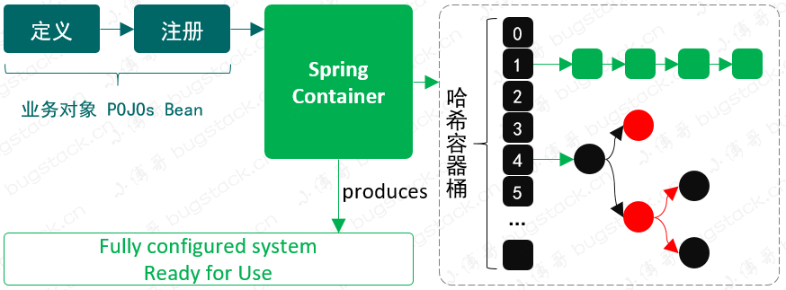
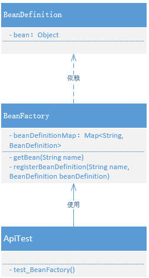

# 1. 实现一个简单的Bean容器

## 1. 目标

Spring Bean 容器是什么？

存放的数据结构是什么？

如何定义这个容器才会更好的管理？

## 2. 设计



- 定义：BeanDefinition bean的scope lazyInit dependsOn beanClass等
- 注册：把Bean放进spring容器中，Hashmap
- 获取：根据key获取对象

## 3. 实现

Spring Bean 容器类关系



1. BeanDefinition，用于定义 Bean 实例化信息，现在的实现是以一个 Object 存放对象
2. BeanFactory，代表了 Bean 对象的工厂，可以存放 Bean 定义到 Map 中以及获取。

```java
public class BeanDefinition {

    private Object bean;

    public BeanDefinition(Object bean) {
        this.bean = bean;
    }

    public Object getBean() {
        return bean;
    }

}
```

```java
public class BeanFactory {

    private Map<String, BeanDefinition> beanDefinitionMap = new ConcurrentHashMap<>();

    public Object getBean(String name) {
        return beanDefinitionMap.get(name).getBean();
    }

    public void registerBeanDefinition(String name, BeanDefinition beanDefinition) {
        beanDefinitionMap.put(name, beanDefinition);
    }

}
```

- 在 Bean 工厂的实现中，包括了 Bean 的注册，这里注册的是 Bean 的定义信息。同时在这个类中还包括了获取 Bean 的操作。
- 目前的 BeanFactory 仍然是非常简化的实现，但这种简化的实现内容也是整个 Spring 容器中关于 Bean 使用的最终体现结果，只不过实现过程只展示出基本的核心原理。在后续的补充实现中，这个会不断变得庞大。

## 4. 测试

```java
public class UserService {

    public void queryUserInfo(){
        System.out.println("查询用户信息");
    }

}
```

```java
@Test
public void test_BeanFactory(){
    // 1.初始化 BeanFactory
    BeanFactory beanFactory = new BeanFactory();
    
    // 2.注册 bean
    BeanDefinition beanDefinition = new BeanDefinition(new UserService());
    beanFactory.registerBeanDefinition("userService", beanDefinition);
    
    // 3.获取 bean
    UserService userService = (UserService) beanFactory.getBean("userService");
    userService.queryUserInfo();
}
```

- 在单测中主要包括初始化 Bean 工厂、注册 Bean、获取 Bean，三个步骤，使用效果上贴近与 Spring，但显得会更简化。
- 在 Bean 的注册中，这里是直接把 UserService 实例化后作为入参传递给 BeanDefinition 的，在后续的陆续实现中，我们会把这部分内容放入 Bean 工厂中实现。

