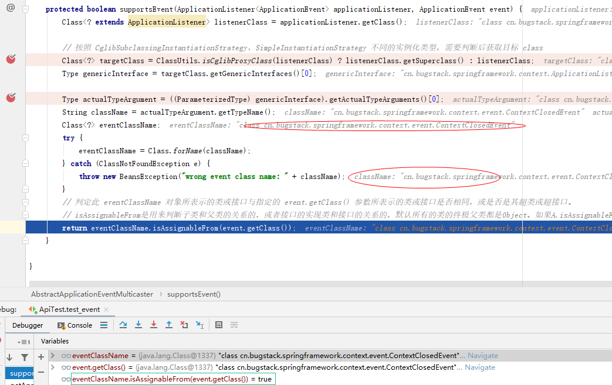

# 10. 基于观察者实现，容器事件和事件监听器 

## 1. 目标

我们需要以观察者模式的方式，设计和实现 Spring Event 的容器事件和事件监听器功能，最终可以让我们在现有实现的 Spring 框架中可以定义、监听和发布自己的事件信息

## 2. 设计


- 在整个功能实现过程中，仍然需要在面向用户的应用上下文 `AbstractApplicationContext` 中添加相关事件内容，包括：初始化事件发布者、注册事件监听器、发布容器刷新完成事件。
- 使用观察者模式定义事件类、监听类、发布类，同时还需要完成一个广播器的功能，接收到事件推送时进行分析处理符合监听事件接受者感兴趣的事件，也就是使用 isAssignableFrom 进行判断。
- isAssignableFrom 和 instanceof 相似，不过 isAssignableFrom 是用来判断子类和父类的关系的，或者接口的实现类和接口的关系的，默认所有的类的终极父类都是Object。如果A.isAssignableFrom(B)结果是true，证明B可以转换成为A,也就是A可以由B转换而来。

## 3. 实现

### 1. 容器事件和事件监听器实现类关系


- 以上整个类关系图以围绕实现 event 事件定义、发布、监听功能实现和把事件的相关内容使用 AbstractApplicationContext#refresh 进行注册和处理操作。
- 在实现的过程中主要以扩展 spring context 包为主，事件的实现也是在这个包下进行扩展的，当然也可以看出来目前所有的实现内容，仍然是以IOC为主。
- ApplicationContext 容器继承事件发布功能接口 ApplicationEventPublisher，并在实现类中提供事件监听功能。
- ApplicationEventMulticaster 接口是注册监听器和发布事件的广播器，提供添加、移除和发布事件方法。
- 最后是发布容器关闭事件，这个仍然需要扩展到 AbstractApplicationContext#close 方法中，由注册到虚拟机的钩子实现。

### 2. 定义和实现事件

```
public abstract class ApplicationEvent extends EventObject {

    /**
     * Constructs a prototypical Event.
     *
     * @param source The object on which the Event initially occurred.
     * @throws IllegalArgumentException if source is null.
     */
    public ApplicationEvent(Object source) {
        super(source);
    }

}
```

- 以继承 java.util.EventObject 定义出具备事件功能的抽象类 ApplicationEvent，后续所有事件的类都需要继承这个类。

```
public class ApplicationContextEvent extends ApplicationEvent {

    /**
     * Constructs a prototypical Event.
     *
     * @param source The object on which the Event initially occurred.
     * @throws IllegalArgumentException if source is null.
     */
    public ApplicationContextEvent(Object source) {
        super(source);
    }

    /**
     * Get the <code>ApplicationContext</code> that the event was raised for.
     */
    public final ApplicationContext getApplicationContext() {
        return (ApplicationContext) getSource();
    }

}
```

```
public class ContextClosedEvent extends ApplicationContextEvent{

    /**
     * Constructs a prototypical Event.
     *
     * @param source The object on which the Event initially occurred.
     * @throws IllegalArgumentException if source is null.
     */
    public ContextClosedEvent(Object source) {
        super(source);
    }

}
```

```
public class ContextRefreshedEvent extends ApplicationContextEvent{
    /**
     * Constructs a prototypical Event.
     *
     * @param source The object on which the Event initially occurred.
     * @throws IllegalArgumentException if source is null.
     */
    public ContextRefreshedEvent(Object source) {
        super(source);
    }

}
```

- ApplicationContextEvent 是定义事件的抽象类，所有的事件包括关闭、刷新，以及用户自己实现的事件，都需要继承这个类。
- ContextClosedEvent、ContextRefreshedEvent，分别是 Spring 框架自己实现的两个事件类，可以用于监听刷新和关闭动作。

### 3. 事件广播器

```
public interface ApplicationEventMulticaster {

    /**
     * Add a listener to be notified of all events.
     * @param listener the listener to add
     */
    void addApplicationListener(ApplicationListener<?> listener);

    /**
     * Remove a listener from the notification list.
     * @param listener the listener to remove
     */
    void removeApplicationListener(ApplicationListener<?> listener);

    /**
     * Multicast the given application event to appropriate listeners.
     * @param event the event to multicast
     */
    void multicastEvent(ApplicationEvent event);

}
```

- 在事件广播器中定义了添加监听和删除监听的方法以及一个广播事件的方法 `multicastEvent` 最终推送时间消息也会经过这个接口方法来处理谁该接收事件。

```
public abstract class AbstractApplicationEventMulticaster implements ApplicationEventMulticaster, BeanFactoryAware {

    public final Set<ApplicationListener<ApplicationEvent>> applicationListeners = new LinkedHashSet<>();

    private BeanFactory beanFactory;

    @Override
    public void addApplicationListener(ApplicationListener<?> listener) {
        applicationListeners.add((ApplicationListener<ApplicationEvent>) listener);
    }

    @Override
    public void removeApplicationListener(ApplicationListener<?> listener) {
        applicationListeners.remove(listener);
    }

    @Override
    public final void setBeanFactory(BeanFactory beanFactory) {
        this.beanFactory = beanFactory;
    }

    protected Collection<ApplicationListener> getApplicationListeners(ApplicationEvent event) {
        LinkedList<ApplicationListener> allListeners = new LinkedList<ApplicationListener>();
        for (ApplicationListener<ApplicationEvent> listener : applicationListeners) {
            if (supportsEvent(listener, event)) allListeners.add(listener);
        }
        return allListeners;
    }

    /**
     * 监听器是否对该事件感兴趣
     */
    protected boolean supportsEvent(ApplicationListener<ApplicationEvent> applicationListener, ApplicationEvent event) {
        Class<? extends ApplicationListener> listenerClass = applicationListener.getClass();

        // 按照 CglibSubclassingInstantiationStrategy、SimpleInstantiationStrategy 不同的实例化类型，需要判断后获取目标 class
        Class<?> targetClass = ClassUtils.isCglibProxyClass(listenerClass) ? listenerClass.getSuperclass() : listenerClass;
        Type genericInterface = targetClass.getGenericInterfaces()[0];

        Type actualTypeArgument = ((ParameterizedType) genericInterface).getActualTypeArguments()[0];
        String className = actualTypeArgument.getTypeName();
        Class<?> eventClassName;
        try {
            eventClassName = Class.forName(className);
        } catch (ClassNotFoundException e) {
            throw new BeansException("wrong event class name: " + className);
        }
        // 判定此 eventClassName 对象所表示的类或接口与指定的 event.getClass() 参数所表示的类或接口是否相同，或是否是其超类或超接口。
        // isAssignableFrom是用来判断子类和父类的关系的，或者接口的实现类和接口的关系的，默认所有的类的终极父类都是Object。如果A.isAssignableFrom(B)结果是true，证明B可以转换成为A,也就是A可以由B转换而来。
        return eventClassName.isAssignableFrom(event.getClass());
    }

}
```

- AbstractApplicationEventMulticaster 是对事件广播器的公用方法提取，在这个类中可以实现一些基本功能，避免所有直接实现接口放还需要处理细节。
- 除了像 addApplicationListener、removeApplicationListener，这样的通用方法，这里这个类中主要是对 getApplicationListeners 和 supportsEvent 的处理。
- getApplicationListeners 方法主要是摘取符合广播事件中的监听处理器，具体过滤动作在 supportsEvent 方法中。
- 在 supportsEvent 方法中，主要包括对Cglib、Simple不同实例化需要获取目标Class，Cglib代理类需要获取父类的Class，普通实例化的不需要。接下来就是通过提取接口和对应的 ParameterizedType 和 eventClassName，方便最后确认是否为子类和父类的关系，以此证明此事件归这个符合的类处理。*可以参考代码中的注释*

**supportsEvent 方法运行截图**



- 在代码调试中可以看到，最终 eventClassName 和 event.getClass() 在 isAssignableFrom 判断下为 true
- 关于 CglibSubclassingInstantiationStrategy、SimpleInstantiationStrategy 可以尝试在 AbstractApplicationContext 类中更换验证。

### 4. 事件发布者的定义和实现

```
public interface ApplicationEventPublisher {

    /**
     * Notify all listeners registered with this application of an application
     * event. Events may be framework events (such as RequestHandledEvent)
     * or application-specific events.
     * @param event the event to publish
     */
    void publishEvent(ApplicationEvent event);

}
```

- ApplicationEventPublisher 是整个一个事件的发布接口，所有的事件都需要从这个接口发布出去。

```
public abstract class AbstractApplicationContext extends DefaultResourceLoader implements ConfigurableApplicationContext {

    public static final String APPLICATION_EVENT_MULTICASTER_BEAN_NAME = "applicationEventMulticaster";

    private ApplicationEventMulticaster applicationEventMulticaster;

    @Override
    public void refresh() throws BeansException {

        // 6. 初始化事件发布者
        initApplicationEventMulticaster();

        // 7. 注册事件监听器
        registerListeners();

        // 9. 发布容器刷新完成事件
        finishRefresh();
    }

    private void initApplicationEventMulticaster() {
        ConfigurableListableBeanFactory beanFactory = getBeanFactory();
        applicationEventMulticaster = new SimpleApplicationEventMulticaster(beanFactory);
        beanFactory.registerSingleton(APPLICATION_EVENT_MULTICASTER_BEAN_NAME, applicationEventMulticaster);
    }

    private void registerListeners() {
        Collection<ApplicationListener> applicationListeners = getBeansOfType(ApplicationListener.class).values();
        for (ApplicationListener listener : applicationListeners) {
            applicationEventMulticaster.addApplicationListener(listener);
        }
    }

    private void finishRefresh() {
        publishEvent(new ContextRefreshedEvent(this));
    }

    @Override
    public void publishEvent(ApplicationEvent event) {
        applicationEventMulticaster.multicastEvent(event);
    }

    @Override
    public void close() {
        // 发布容器关闭事件
        publishEvent(new ContextClosedEvent(this));

        // 执行销毁单例bean的销毁方法
        getBeanFactory().destroySingletons();
    }

}
```

- 在抽象应用上下文 AbstractApplicationContext#refresh 中，主要新增了 `初始化事件发布者`、`注册事件监听器`、`发布容器刷新完成事件`，三个方法用于处理事件操作。
- 初始化事件发布者(initApplicationEventMulticaster)，主要用于实例化一个 SimpleApplicationEventMulticaster，这是一个事件广播器。
- 注册事件监听器(registerListeners)，通过 getBeansOfType 方法获取到所有从 spring.xml 中加载到的事件配置 Bean 对象。
- 发布容器刷新完成事件(finishRefresh)，发布了第一个服务器启动完成后的事件，这个事件通过 publishEvent 发布出去，其实也就是调用了 applicationEventMulticaster.multicastEvent(event); 方法。
- 最后是一个 close 方法中，新增加了发布一个容器关闭事件。`publishEvent(new ContextClosedEvent(this));`

## 4. 测试

### 1. 创建一个事件和监听器

```
public class CustomEvent extends ApplicationContextEvent {

    private Long id;
    private String message;

    /**
     * Constructs a prototypical Event.
     *
     * @param source The object on which the Event initially occurred.
     * @throws IllegalArgumentException if source is null.
     */
    public CustomEvent(Object source, Long id, String message) {
        super(source);
        this.id = id;
        this.message = message;
    }

    // ...get/set
}
```

- 创建一个自定义事件，在事件类的构造函数中可以添加自己的想要的入参信息。这个事件类最终会被完成的拿到监听里，所以你添加的属性都会被获得到。

```
public class CustomEventListener implements ApplicationListener<CustomEvent> {

    @Override
    public void onApplicationEvent(CustomEvent event) {
        System.out.println("收到：" + event.getSource() + "消息;时间：" + new Date());
        System.out.println("消息：" + event.getId() + ":" + event.getMessage());
    }

}
```

- 这个是一个用于监听 CustomEvent 事件的监听器，这里你可以处理自己想要的操作，比如一些用户注册后发送优惠券和短信通知等。
- 另外是关于 `ContextRefreshedEventListener implements ApplicationListener<ContextRefreshedEvent>`、`ContextClosedEventListener implements ApplicationListener<ContextClosedEvent>` 监听器，这里就不演示了，可以参考下源码。

### 2. 配置文件

```
<?xml version="1.0" encoding="UTF-8"?>
<beans>

    <bean class="cn.bugstack.springframework.test.event.ContextRefreshedEventListener"/>

    <bean class="cn.bugstack.springframework.test.event.CustomEventListener"/>

    <bean class="cn.bugstack.springframework.test.event.ContextClosedEventListener"/>

</beans>
```

- 在 spring.xml 中配置了三个事件监听器，监听刷新、监控自定义事件、监听关闭事件。

### 3. 单元测试

```
public class ApiTest {

    @Test
    public void test_event() {
        ClassPathXmlApplicationContext applicationContext = new ClassPathXmlApplicationContext("classpath:spring.xml");
        applicationContext.publishEvent(new CustomEvent(applicationContext, 1019129009086763L, "成功了！"));

        applicationContext.registerShutdownHook();
    }

}
```

- 通过使用 applicationContext 新增加的发布事件接口方法，发布一个自定义事件 CustomEvent，并透传了相应的参数信息。

**测试结果**

```
刷新事件：cn.bugstack.springframework.test.event.ContextRefreshedEventListener$$EnhancerByCGLIB$$440a36f5
收到：cn.bugstack.springframework.context.support.ClassPathXmlApplicationContext@71c7db30消息;时间：22:32:50
消息：1019129009086763:成功了！
关闭事件：cn.bugstack.springframework.test.event.ContextClosedEventListener$$EnhancerByCGLIB$$f4d4b18d

Process finished with exit code 0
```

- 从测试结果可以看到，我们自己定义的事件和监听，以及监听系统的事件信息，都可以在控制台完整的输出出来了。你也可以尝试增加一些其他事件行为，并调试代码学习观察者模式。

