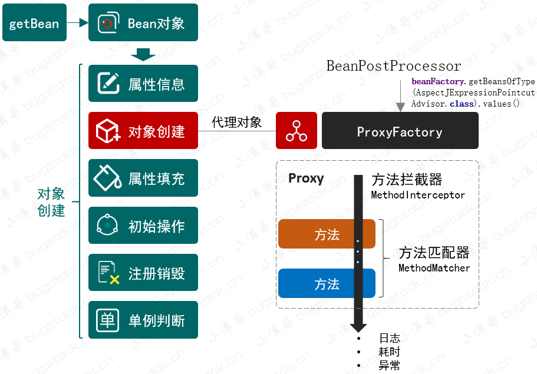
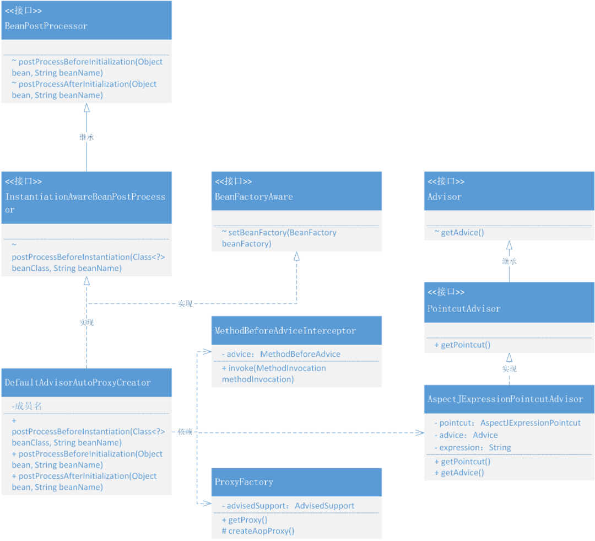

# 12. 把AOP动态代理，融入到Bean的生命周期

## 1. 目标

我们需要在本章节完成 AOP 核心功能与 Spring 框架的整合，最终能通过在 Spring 配置的方式完成切面的操作。

## 2. 设计



- 为了可以让对象创建过程中，能把xml中配置的代理对象也就是切面的一些类对象实例化，就需要用到 BeanPostProcessor 提供的方法，因为这个类的中的方法可以分别作用与 Bean 对象执行初始化前后修改 Bean 的对象的扩展信息。但这里需要集合于 BeanPostProcessor 实现新的接口和实现类，这样才能定向获取对应的类信息。
- 但因为创建的是代理对象不是之前流程里的普通对象，所以我们需要前置于其他对象的创建，所以在实际开发的过程中，需要在 AbstractAutowireCapableBeanFactory#createBean 优先完成 Bean 对象的判断，是否需要代理，有则直接返回代理对象。*在Spring的源码中会有 createBean 和 doCreateBean 的方法拆分*
- 这里还包括要解决方法拦截器的具体功能，提供一些 BeforeAdvice、AfterAdvice 的实现，让用户可以更简化的使用切面功能。除此之外还包括需要包装切面表达式以及拦截方法的整合，以及提供不同类型的代理方式的代理工厂，来包装我们的切面服务。

## 3. 实现

### 1. AOP 动态代理融入到Bean的生命周期中类关系



- 整个类关系图中可以看到，在以 BeanPostProcessor 接口实现继承的 InstantiationAwareBeanPostProcessor 接口后，做了一个自动代理创建的类 DefaultAdvisorAutoProxyCreator，这个类的就是用于处理整个 AOP 代理融入到 Bean 生命周期中的核心类。
- DefaultAdvisorAutoProxyCreator 会依赖于拦截器、代理工厂和Pointcut与Advisor的包装服务 AspectJExpressionPointcutAdvisor，由它提供切面、拦截方法和表达式。
- Spring 的 AOP 把 Advice 细化了 BeforeAdvice、AfterAdvice、AfterReturningAdvice、ThrowsAdvice，目前我们做的测试案例中只用到了 BeforeAdvice，这部分可以对照 Spring 的源码进行补充测试。

### 2. 定义Advice拦截器链

```
public interface BeforeAdvice extends Advice {

}
```

```
public interface MethodBeforeAdvice extends BeforeAdvice {

    /**
     * Callback before a given method is invoked.
     *
     * @param method method being invoked
     * @param args   arguments to the method
     * @param target target of the method invocation. May be <code>null</code>.
     * @throws Throwable if this object wishes to abort the call.
     *                   Any exception thrown will be returned to the caller if it's
     *                   allowed by the method signature. Otherwise the exception
     *                   will be wrapped as a runtime exception.
     */
    void before(Method method, Object[] args, Object target) throws Throwable;

}
```

- 在 Spring 框架中，Advice 都是通过方法拦截器 MethodInterceptor 实现的。环绕 Advice 类似一个拦截器的链路，Before Advice、After advice等，不过暂时我们需要那么多就只定义了一个 MethodBeforeAdvice 的接口定义。

### 3. 定义 Advisor 访问者

```
public interface Advisor {

    /**
     * Return the advice part of this aspect. An advice may be an
     * interceptor, a before advice, a throws advice, etc.
     * @return the advice that should apply if the pointcut matches
     * @see org.aopalliance.intercept.MethodInterceptor
     * @see BeforeAdvice
     */
    Advice getAdvice();

}
```

```
public interface PointcutAdvisor extends Advisor {

    /**
     * Get the Pointcut that drives this advisor.
     */
    Pointcut getPointcut();

}
```

- Advisor 承担了 Pointcut 和 Advice 的组合，Pointcut 用于获取 JoinPoint，而 Advice 决定于 JoinPoint 执行什么操作。

```
public class AspectJExpressionPointcutAdvisor implements PointcutAdvisor {

    // 切面
    private AspectJExpressionPointcut pointcut;
    // 具体的拦截方法
    private Advice advice;
    // 表达式
    private String expression;

    public void setExpression(String expression){
        this.expression = expression;
    }

    @Override
    public Pointcut getPointcut() {
        if (null == pointcut) {
            pointcut = new AspectJExpressionPointcut(expression);
        }
        return pointcut;
    }

    @Override
    public Advice getAdvice() {
        return advice;
    }

    public void setAdvice(Advice advice){
        this.advice = advice;
    }

}
```

- AspectJExpressionPointcutAdvisor 实现了 PointcutAdvisor 接口，把切面 pointcut、拦截方法 advice 和具体的拦截表达式包装在一起。这样就可以在 xml 的配置中定义一个 pointcutAdvisor 切面拦截器了。

### 4. 方法拦截器

```
public class MethodBeforeAdviceInterceptor implements MethodInterceptor {

    private MethodBeforeAdvice advice;

    public MethodBeforeAdviceInterceptor(MethodBeforeAdvice advice) {
        this.advice = advice;
    }

    @Override
    public Object invoke(MethodInvocation methodInvocation) throws Throwable {
        this.advice.before(methodInvocation.getMethod(), methodInvocation.getArguments(), methodInvocation.getThis());
        return methodInvocation.proceed();
    }

}
```

- MethodBeforeAdviceInterceptor 实现了 MethodInterceptor 接口，在 invoke 方法中调用 advice 中的 before 方法，传入对应的参数信息。
- 而这个 advice.before 则是用于自己实现 MethodBeforeAdvice 接口后做的相应处理。*其实可以看到具体的 MethodInterceptor 实现类，其实和我们之前做的测试是一样的，只不过现在交给了 Spring 来处理*

### 5. 代理工厂

```
public class ProxyFactory {

    private AdvisedSupport advisedSupport;

    public ProxyFactory(AdvisedSupport advisedSupport) {
        this.advisedSupport = advisedSupport;
    }

    public Object getProxy() {
        return createAopProxy().getProxy();
    }

    private AopProxy createAopProxy() {
        if (advisedSupport.isProxyTargetClass()) {
            return new Cglib2AopProxy(advisedSupport);
        }

        return new JdkDynamicAopProxy(advisedSupport);
    }

}
```

- 其实这个代理工厂主要解决的是关于 JDK 和 Cglib 两种代理的选择问题，有了代理工厂就可以按照不同的创建需求进行控制。

### 6. 融入Bean生命周期的自动代理创建者

```
public class DefaultAdvisorAutoProxyCreator implements InstantiationAwareBeanPostProcessor, BeanFactoryAware {

    private DefaultListableBeanFactory beanFactory;

    @Override
    public void setBeanFactory(BeanFactory beanFactory) throws BeansException {
        this.beanFactory = (DefaultListableBeanFactory) beanFactory;
    }

    @Override
    public Object postProcessBeforeInstantiation(Class<?> beanClass, String beanName) throws BeansException {

        if (isInfrastructureClass(beanClass)) return null;

        Collection<AspectJExpressionPointcutAdvisor> advisors = beanFactory.getBeansOfType(AspectJExpressionPointcutAdvisor.class).values();

        for (AspectJExpressionPointcutAdvisor advisor : advisors) {
            ClassFilter classFilter = advisor.getPointcut().getClassFilter();
            if (!classFilter.matches(beanClass)) continue;

            AdvisedSupport advisedSupport = new AdvisedSupport();

            TargetSource targetSource = null;
            try {
                targetSource = new TargetSource(beanClass.getDeclaredConstructor().newInstance());
            } catch (Exception e) {
                e.printStackTrace();
            }
            advisedSupport.setTargetSource(targetSource);
            advisedSupport.setMethodInterceptor((MethodInterceptor) advisor.getAdvice());
            advisedSupport.setMethodMatcher(advisor.getPointcut().getMethodMatcher());
            advisedSupport.setProxyTargetClass(false);

            return new ProxyFactory(advisedSupport).getProxy();

        }

        return null;
    }
    
}
```

- 这个 DefaultAdvisorAutoProxyCreator 类的主要核心实现在于 postProcessBeforeInstantiation 方法中，从通过 beanFactory.getBeansOfType 获取 AspectJExpressionPointcutAdvisor 开始。
- 获取了 advisors 以后就可以遍历相应的 AspectJExpressionPointcutAdvisor 填充对应的属性信息，包括：目标对象、拦截方法、匹配器，之后返回代理对象即可。
- 那么现在调用方获取到的这个 Bean 对象就是一个已经被切面注入的对象了，当调用方法的时候，则会被按需拦截，处理用户需要的信息。

## 4. 测试

### 1. 事先准备

```
public class UserService implements IUserService {

    public String queryUserInfo() {
        try {
            Thread.sleep(new Random(1).nextInt(100));
        } catch (InterruptedException e) {
            e.printStackTrace();
        }
        return "张三，100001，深圳";
    }

    public String register(String userName) {
        try {
            Thread.sleep(new Random(1).nextInt(100));
        } catch (InterruptedException e) {
            e.printStackTrace();
        }
        return "注册用户：" + userName + " success！";
    }

}
```

- 在 UserService 中提供了2个不同方法，另外你还可以增加新的类来加入测试。后面我们的测试过程，会给这个两个方法添加我们的拦截处理，打印方法执行耗时。

### 2. 自定义拦截方法

```
public class UserServiceBeforeAdvice implements MethodBeforeAdvice {

    @Override
    public void before(Method method, Object[] args, Object target) throws Throwable {
        System.out.println("拦截方法：" + method.getName());
    }

}
```

- 与上一章节的拦截方法相比，我们不在是实现 MethodInterceptor 接口，而是实现 MethodBeforeAdvice 环绕拦截。在这个方法中我们可以获取到方法的一些信息，如果还开发了它的 MethodAfterAdvice 则可以两个接口一起实现。

### 3. spring.xml 配置 AOP

```
<beans>

    <bean id="userService" class="cn.bugstack.springframework.test.bean.UserService"/>

    <bean class="cn.bugstack.springframework.aop.framework.autoproxy.DefaultAdvisorAutoProxyCreator"/>

    <bean id="beforeAdvice" class="cn.bugstack.springframework.test.bean.UserServiceBeforeAdvice"/>

    <bean id="methodInterceptor" class="cn.bugstack.springframework.aop.framework.adapter.MethodBeforeAdviceInterceptor">
        <property name="advice" ref="beforeAdvice"/>
    </bean>

    <bean id="pointcutAdvisor" class="cn.bugstack.springframework.aop.aspectj.AspectJExpressionPointcutAdvisor">
        <property name="expression" value="execution(* cn.bugstack.springframework.test.bean.IUserService.*(..))"/>
        <property name="advice" ref="methodInterceptor"/>
    </bean>

</beans>
```

- 这回再使用 AOP 就可以像 Spring 中一样，通过在 xml 中配置即可。因为我们已经把 AOP 的功能融合到 Bean 的生命周期里去了，你的新增拦截方法都会被自动处理。

### 4. 单元测试

```
@Test
public void testAop() {
    ClassPathXmlApplicationContext applicationContext = new ClassPathXmlApplicationContext("classpath:spring.xml");
    IUserService userService = applicationContext.getBean("userService", IUserService.class);
    System.out.println("测试结果：" + userService.queryUserInfo());
}
```

- 在单元测试中你只需要按照正常获取和使用 Bean 对象即可，不过这个时候如果被切面拦截了，那么其实你获取到的就是对应的代理对象里面的处理操作了。

**测试结果**


```
拦截方法：queryUserInfo
测试结果：张三，100001，深圳

Process finished with exit code 0
```

- 通过测试结果可以看到，我们已经让拦截方法生效了，也不需要自己手动处理切面、拦截方法等内容。*截图上可以看到，这个时候的 IUserService 就是一个代理对象*

