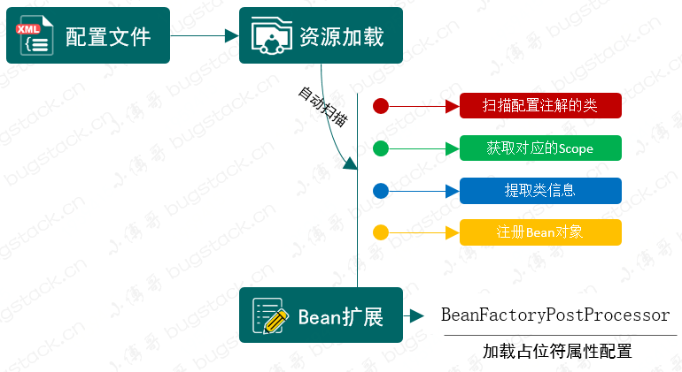
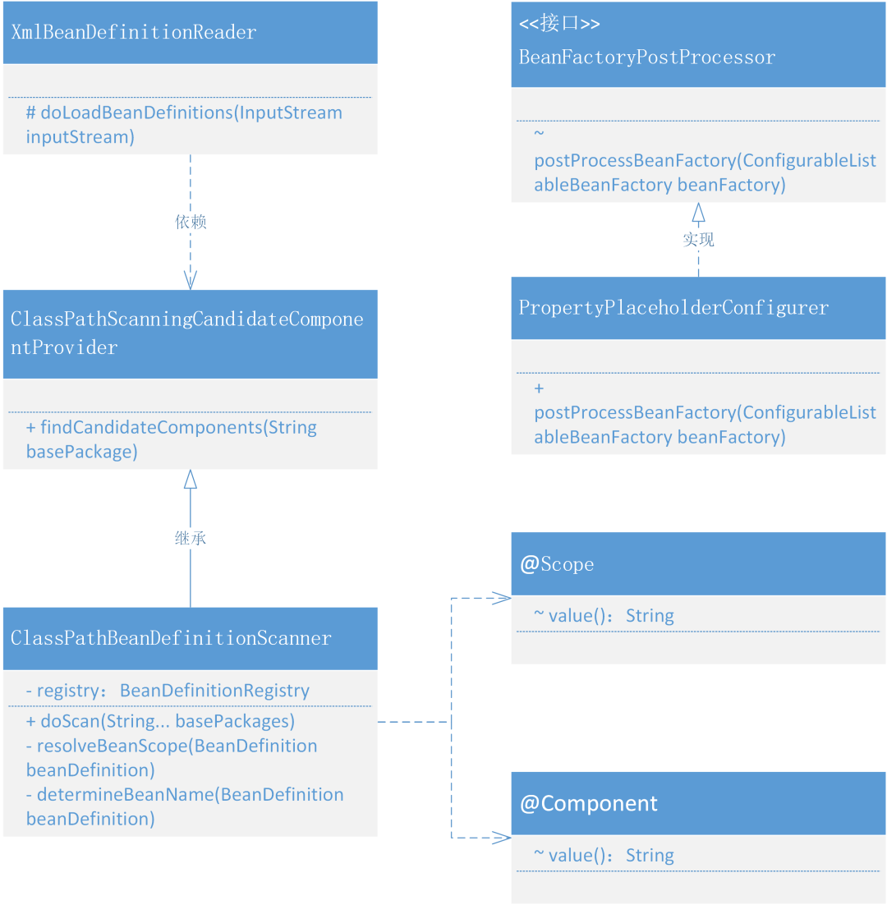

# 13. 通过注解配置和包自动扫描的方式完成Bean对象的注册

## 1. 目标

包的扫描注册、注解配置的使用、占位符属性的填充

## 2. 设计



- 自动扫描注册主要是扫描添加了自定义注解的类，在xml加载过程中提取类的信息，组装 BeanDefinition 注册到 Spring 容器中。
- 所以我们会用到 `<context:component-scan />` 配置包路径并在 XmlBeanDefinitionReader 解析并做相应的处理。*这里的处理会包括对类的扫描、获取注解信息等*
- 最后还包括了一部分关于 `BeanFactoryPostProcessor` 的使用，因为我们需要完成对占位符配置信息的加载，所以需要使用到 BeanFactoryPostProcessor 在所有的 BeanDefinition 加载完成后，实例化 Bean 对象之前，修改 BeanDefinition 的属性信息。*这一部分的实现也为后续处理关于占位符配置到注解上做准备*

## 3. 实现

### 1. 在Bean的生命周期中自动加载包扫描注册Bean对象和设置占位符属性的类关系



- 整个类的关系结构来看，其实涉及的内容并不多，主要包括的就是 xml 解析类 XmlBeanDefinitionReader 对 ClassPathBeanDefinitionScanner#doScan 的使用。
- 在 doScan 方法中处理所有指定路径下添加了注解的类，拆解出类的信息：名称、作用范围等，进行创建 BeanDefinition 好用于 Bean 对象的注册操作。
- PropertyPlaceholderConfigurer 目前看上去像一块单独的内容，后续会把这块的内容与自动加载 Bean 对象进行整合，也就是可以在注解上使用占位符配置一些在配置文件里的属性信息。

### 2. 处理占位符配置

```
public class PropertyPlaceholderConfigurer implements BeanFactoryPostProcessor {

    /**
     * Default placeholder prefix: {@value}
     */
    public static final String DEFAULT_PLACEHOLDER_PREFIX = "${";

    /**
     * Default placeholder suffix: {@value}
     */
    public static final String DEFAULT_PLACEHOLDER_SUFFIX = "}";

    private String location;

    @Override
    public void postProcessBeanFactory(ConfigurableListableBeanFactory beanFactory) throws BeansException {
        // 加载属性文件
        try {
            DefaultResourceLoader resourceLoader = new DefaultResourceLoader();
            Resource resource = resourceLoader.getResource(location);
            Properties properties = new Properties();
            properties.load(resource.getInputStream());

            String[] beanDefinitionNames = beanFactory.getBeanDefinitionNames();
            for (String beanName : beanDefinitionNames) {
                BeanDefinition beanDefinition = beanFactory.getBeanDefinition(beanName);

                PropertyValues propertyValues = beanDefinition.getPropertyValues();
                for (PropertyValue propertyValue : propertyValues.getPropertyValues()) {
                    Object value = propertyValue.getValue();
                    if (!(value instanceof String)) continue;
                    String strVal = (String) value;
                    StringBuilder buffer = new StringBuilder(strVal);
                    int startIdx = strVal.indexOf(DEFAULT_PLACEHOLDER_PREFIX);
                    int stopIdx = strVal.indexOf(DEFAULT_PLACEHOLDER_SUFFIX);
                    if (startIdx != -1 && stopIdx != -1 && startIdx < stopIdx) {
                        String propKey = strVal.substring(startIdx + 2, stopIdx);
                        String propVal = properties.getProperty(propKey);
                        buffer.replace(startIdx, stopIdx + 1, propVal);
                        propertyValues.addPropertyValue(new PropertyValue(propertyValue.getName(), buffer.toString()));
                    }
                }
            }
        } catch (IOException e) {
            throw new BeansException("Could not load properties", e);
        }
    }

    public void setLocation(String location) {
        this.location = location;
    }

}
```

- 依赖于 BeanFactoryPostProcessor 在 Bean 生命周期的属性，可以在 Bean 对象实例化之前，改变属性信息。所以这里通过实现 BeanFactoryPostProcessor 接口，完成对配置文件的加载以及摘取占位符中的在属性文件里的配置。
- 这样就可以把提取到的配置信息放置到属性配置中了，`buffer.replace(startIdx, stopIdx + 1, propVal); propertyValues.addPropertyValue`

### 3. 定义拦截注解

```
@Target({ElementType.TYPE, ElementType.METHOD})
@Retention(RetentionPolicy.RUNTIME)
@Documented
public @interface Scope {

    String value() default "singleton";

}
```

- 用于配置作用域的自定义注解，方便通过配置Bean对象注解的时候，拿到Bean对象的作用域。*不过一般都使用默认的 singleton*

```
@Target(ElementType.TYPE)
@Retention(RetentionPolicy.RUNTIME)
@Documented
public @interface Component {

    String value() default "";

}
```

- Component 自定义注解大家都非常熟悉了，用于配置到 Class 类上的。除此之外还有 Service、Controller，不过所有的处理方式基本一致，这里就只展示一个 Component 即可。

### 4. 处理对象扫描装配

```
public class ClassPathScanningCandidateComponentProvider {

    public Set<BeanDefinition> findCandidateComponents(String basePackage) {
        Set<BeanDefinition> candidates = new LinkedHashSet<>();
        Set<Class<?>> classes = ClassUtil.scanPackageByAnnotation(basePackage, Component.class);
        for (Class<?> clazz : classes) {
            candidates.add(new BeanDefinition(clazz));
        }
        return candidates;
    }

}
```

- 这里先要提供一个可以通过配置路径 `basePackage=cn.bugstack.springframework.test.bean`，解析出 classes 信息的工具方法 findCandidateComponents，通过这个方法就可以扫描到所有 @Component 注解的 Bean 对象了。

```
public class ClassPathBeanDefinitionScanner extends ClassPathScanningCandidateComponentProvider {

    private BeanDefinitionRegistry registry;

    public ClassPathBeanDefinitionScanner(BeanDefinitionRegistry registry) {
        this.registry = registry;
    }

    public void doScan(String... basePackages) {
        for (String basePackage : basePackages) {
            Set<BeanDefinition> candidates = findCandidateComponents(basePackage);
            for (BeanDefinition beanDefinition : candidates) {
                // 解析 Bean 的作用域 singleton、prototype
                String beanScope = resolveBeanScope(beanDefinition);
                if (StrUtil.isNotEmpty(beanScope)) {
                    beanDefinition.setScope(beanScope);
                }
                registry.registerBeanDefinition(determineBeanName(beanDefinition), beanDefinition);
            }
        }
    }

    private String resolveBeanScope(BeanDefinition beanDefinition) {
        Class<?> beanClass = beanDefinition.getBeanClass();
        Scope scope = beanClass.getAnnotation(Scope.class);
        if (null != scope) return scope.value();
        return StrUtil.EMPTY;
    }

    private String determineBeanName(BeanDefinition beanDefinition) {
        Class<?> beanClass = beanDefinition.getBeanClass();
        Component component = beanClass.getAnnotation(Component.class);
        String value = component.value();
        if (StrUtil.isEmpty(value)) {
            value = StrUtil.lowerFirst(beanClass.getSimpleName());
        }
        return value;
    }

}
```

- ClassPathBeanDefinitionScanner 是继承自 ClassPathScanningCandidateComponentProvider 的具体扫描包处理的类，在 doScan 中除了获取到扫描的类信息以后，还需要获取 Bean 的作用域和类名，如果不配置类名基本都是把首字母缩写。

### 5. 解析xml中调用扫描

```
public class XmlBeanDefinitionReader extends AbstractBeanDefinitionReader {

    protected void doLoadBeanDefinitions(InputStream inputStream) throws ClassNotFoundException, DocumentException {
        SAXReader reader = new SAXReader();
        Document document = reader.read(inputStream);
        Element root = document.getRootElement();

        // 解析 context:component-scan 标签，扫描包中的类并提取相关信息，用于组装 BeanDefinition
        Element componentScan = root.element("component-scan");
        if (null != componentScan) {
            String scanPath = componentScan.attributeValue("base-package");
            if (StrUtil.isEmpty(scanPath)) {
                throw new BeansException("The value of base-package attribute can not be empty or null");
            }
            scanPackage(scanPath);
        }
       
        // ... 省略其他
            
        // 注册 BeanDefinition
        getRegistry().registerBeanDefinition(beanName, beanDefinition);
    }

    private void scanPackage(String scanPath) {
        String[] basePackages = StrUtil.splitToArray(scanPath, ',');
        ClassPathBeanDefinitionScanner scanner = new ClassPathBeanDefinitionScanner(getRegistry());
        scanner.doScan(basePackages);
    }

}
```

- 关于 XmlBeanDefinitionReader 中主要是在加载配置文件后，处理新增的自定义配置属性 `component-scan`，解析后调用 scanPackage 方法，其实也就是我们在 ClassPathBeanDefinitionScanner#doScan 功能。
- 另外这里需要注意，为了可以方便的加载和解析xml，XmlBeanDefinitionReader 已经全部替换为 dom4j 的方式进行解析处理。

## 4. 测试

### 1. 事先准备

```
@Component("userService")
public class UserService implements IUserService {

    private String token;

    public String queryUserInfo() {
        try {
            Thread.sleep(new Random(1).nextInt(100));
        } catch (InterruptedException e) {
            e.printStackTrace();
        }
        return "张三，100001，深圳";
    }

    public String register(String userName) {
        try {
            Thread.sleep(new Random(1).nextInt(100));
        } catch (InterruptedException e) {
            e.printStackTrace();
        }
        return "注册用户：" + userName + " success！";
    }

    @Override
    public String toString() {
        return "UserService#token = { " + token + " }";
    }

    public String getToken() {
        return token;
    }

    public void setToken(String token) {
        this.token = token;
    }
}
```

- 给 UserService 类添加一个自定义注解 `@Component("userService")` 和一个属性信息 `String token`。这是为了分别测试包扫描和占位符属性。

### 2. 属性配置文件

```
token=RejDlI78hu223Opo983Ds
```

- 这里配置一个 token 的属性信息，用于通过占位符的方式进行获取

### 3. spring.xml 配置对象

**spring-property.xml**

```
<?xml version="1.0" encoding="UTF-8"?>
<beans xmlns="http://www.springframework.org/schema/beans"
       xmlns:xsi="http://www.w3.org/2001/XMLSchema-instance"
       xmlns:context="http://www.springframework.org/schema/context"
       xsi:schemaLocation="http://www.springframework.org/schema/beans
          http://www.springframework.org/schema/beans/spring-beans.xsd
   http://www.springframework.org/schema/context">

    <bean class="cn.bugstack.springframework.beans.factory.PropertyPlaceholderConfigurer">
        <property name="location" value="classpath:token.properties"/>
    </bean>

    <bean id="userService" class="cn.bugstack.springframework.test.bean.UserService">
        <property name="token" value="${token}"/>
    </bean>

</beans>
```

- 加载 `classpath:token.properties` 设置占位符属性值 `${token}`

**spring-scan.xml**

```
<?xml version="1.0" encoding="UTF-8"?>
<beans xmlns="http://www.springframework.org/schema/beans"
       xmlns:xsi="http://www.w3.org/2001/XMLSchema-instance"
       xmlns:context="http://www.springframework.org/schema/context"
       xsi:schemaLocation="http://www.springframework.org/schema/beans
          http://www.springframework.org/schema/beans/spring-beans.xsd
   http://www.springframework.org/schema/context">

    <context:component-scan base-package="cn.bugstack.springframework.test.bean"/>

</beans>
```

- 添加 `component-scan` 属性，设置包扫描根路径

### 4. 单元测试(占位符)

```
@Test
public void testProperty() {
    ClassPathXmlApplicationContext applicationContext = new ClassPathXmlApplicationContext("classpath:spring-property.xml");
    IUserService userService = applicationContext.getBean("userService", IUserService.class);
    System.out.println("测试结果：" + userService);
}
```

**测试结果**

```
测试结果：UserService#token = { RejDlI78hu223Opo983Ds }

Process finished with exit code 0
```

- 通过测试结果可以看到 UserService 中的 token 属性已经通过占位符的方式设置进去配置文件里的 `token.properties` 的属性值了。

### 5. 单元测试(包扫描)

```
@Test
public void testScan() {
    ClassPathXmlApplicationContext applicationContext = new ClassPathXmlApplicationContext("classpath:spring-scan.xml");
    IUserService userService = applicationContext.getBean("userService", IUserService.class);
    System.out.println("测试结果：" + userService.queryUserInfo());
}
```

**测试结果**

```
测试结果：张三，100001，深圳

Process finished with exit code 0
```

- 通过这个测试结果可以看出来，现在使用注解的方式就可以让 Class 注册完成 Bean 对象了。

