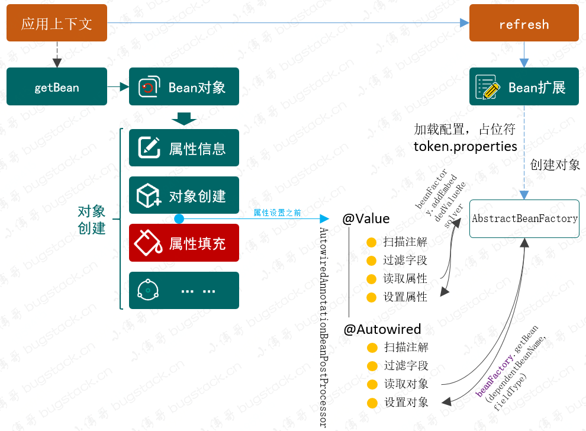
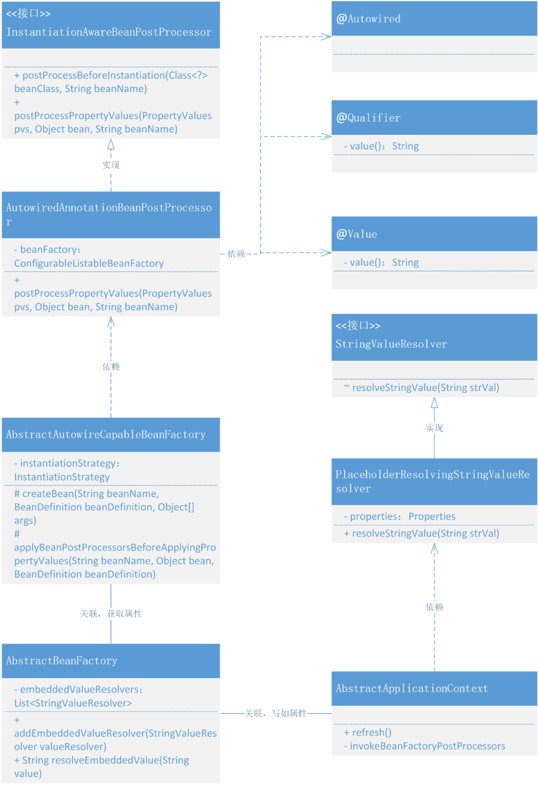

# 14. 通过注解给属性注入配置和Bean对象

## 1. 目标

配置属性和Bean的操作，也改为可以自动注入。这就像我们使用 Spring 框架中 `@Autowired`、`@Value` 注解一样，完成我们对属性和对象的注入操作。

## 2. 设计



- 要处理自动扫描注入，包括属性注入、对象注入，则需要在对象属性 `applyPropertyValues` 填充之前 ，把属性信息写入到 PropertyValues 的集合中去。这一步的操作相当于是解决了以前在 spring.xml 配置属性的过程。
- 而在属性的读取中，需要依赖于对 Bean 对象的类中属性的配置了注解的扫描，`field.getAnnotation(Value.class);` 依次拿出符合的属性并填充上相应的配置信息。*这里有一点 ，属性的配置信息需要依赖于 BeanFactoryPostProcessor 的实现类 PropertyPlaceholderConfigurer，把值写入到 AbstractBeanFactory的embeddedValueResolvers集合中，这样才能在属性填充中利用 beanFactory 获取相应的属性值*
- 还有一个是关于 @Autowired 对于对象的注入，其实这一个和属性注入的唯一区别是对于对象的获取 `beanFactory.getBean(fieldType)`，其他就没有什么差一点了。
- 当所有的属性被设置到 PropertyValues  完成以后，接下来就到了创建对象的下一步，属性填充，而此时就会把我们一一获取到的配置和对象填充到属性上，也就实现了自动注入的功能。

## 3. 实现

### 1. 自动扫描注入占位符配置和对象的类关系



- 在整个类图中以围绕实现接口 InstantiationAwareBeanPostProcessor 的类 AutowiredAnnotationBeanPostProcessor 作为入口点，被 AbstractAutowireCapableBeanFactory创建 Bean 对象过程中调用扫描整个类的属性配置中含有自定义注解 `Value`、`Autowired`、`Qualifier`，的属性值。
- 这里稍有变动的是关于属性值信息的获取，在注解配置的属性字段扫描到信息注入时，包括了占位符从配置文件获取信息也包括 Bean 对象，Bean 对象可以直接获取，但配置信息需要在 AbstractBeanFactory 中添加新的属性集合 embeddedValueResolvers，由 PropertyPlaceholderConfigurer#postProcessBeanFactory 进行操作填充到属性集合中。

### 2. 把读取到属性填充到容器

**定义解析字符串接口**

```
public interface StringValueResolver {

    String resolveStringValue(String strVal);

}
```

- 接口 StringValueResolver 是一个解析字符串操作的接口

**填充字符串**

```
public class PropertyPlaceholderConfigurer implements BeanFactoryPostProcessor {

    @Override
    public void postProcessBeanFactory(ConfigurableListableBeanFactory beanFactory) throws BeansException {
        try {
            // 加载属性文件
            DefaultResourceLoader resourceLoader = new DefaultResourceLoader();
            Resource resource = resourceLoader.getResource(location);
            
            // ... 占位符替换属性值、设置属性值

            // 向容器中添加字符串解析器，供解析@Value注解使用
            StringValueResolver valueResolver = new PlaceholderResolvingStringValueResolver(properties);
            beanFactory.addEmbeddedValueResolver(valueResolver);
            
        } catch (IOException e) {
            throw new BeansException("Could not load properties", e);
        }
    }

    private class PlaceholderResolvingStringValueResolver implements StringValueResolver {

        private final Properties properties;

        public PlaceholderResolvingStringValueResolver(Properties properties) {
            this.properties = properties;
        }

        @Override
        public String resolveStringValue(String strVal) {
            return PropertyPlaceholderConfigurer.this.resolvePlaceholder(strVal, properties);
        }

    }

}
```

- 在解析属性配置的类 PropertyPlaceholderConfigurer 中，最主要的其实就是这行代码的操作 `beanFactory.addEmbeddedValueResolver(valueResolver)` 这是把属性值写入到了 AbstractBeanFactory 的 embeddedValueResolvers 中。
- 这里说明下，embeddedValueResolvers 是 AbstractBeanFactory 类新增加的集合 `List<StringValueResolver> embeddedValueResolvers` String resolvers to apply e.g. to annotation attribute values

### 3. 自定义属性注入注解

**自定义注解，Autowired、Qualifier、Value**

```
@Retention(RetentionPolicy.RUNTIME)
@Target({ElementType.CONSTRUCTOR, ElementType.FIELD, ElementType.METHOD})
public @interface Autowired {
}

@Target({ElementType.FIELD, ElementType.METHOD, ElementType.PARAMETER, ElementType.TYPE, ElementType.ANNOTATION_TYPE})
@Retention(RetentionPolicy.RUNTIME)
@Inherited
@Documented
public @interface Qualifier {

    String value() default "";

}  

@Target({ElementType.FIELD, ElementType.METHOD, ElementType.PARAMETER})
@Retention(RetentionPolicy.RUNTIME)
@Documented
public @interface Value {

    /**
     * The actual value expression: e.g. "#{systemProperties.myProp}".
     */
    String value();

}
```

- 3个注解在我们日常使用 Spring 也是非常常见的，注入对象、注入属性，而 Qualifier 一般与 Autowired 配合使用。

### 4. 扫描自定义注解

```
public class AutowiredAnnotationBeanPostProcessor implements InstantiationAwareBeanPostProcessor, BeanFactoryAware {

    private ConfigurableListableBeanFactory beanFactory;

    @Override
    public void setBeanFactory(BeanFactory beanFactory) throws BeansException {
        this.beanFactory = (ConfigurableListableBeanFactory) beanFactory;
    }

    @Override
    public PropertyValues postProcessPropertyValues(PropertyValues pvs, Object bean, String beanName) throws BeansException {
        // 1. 处理注解 @Value
        Class<?> clazz = bean.getClass();
        clazz = ClassUtils.isCglibProxyClass(clazz) ? clazz.getSuperclass() : clazz;

        Field[] declaredFields = clazz.getDeclaredFields();

        for (Field field : declaredFields) {
            Value valueAnnotation = field.getAnnotation(Value.class);
            if (null != valueAnnotation) {
                String value = valueAnnotation.value();
                value = beanFactory.resolveEmbeddedValue(value);
                BeanUtil.setFieldValue(bean, field.getName(), value);
            }
        }

        // 2. 处理注解 @Autowired
        for (Field field : declaredFields) {
            Autowired autowiredAnnotation = field.getAnnotation(Autowired.class);
            if (null != autowiredAnnotation) {
                Class<?> fieldType = field.getType();
                String dependentBeanName = null;
                Qualifier qualifierAnnotation = field.getAnnotation(Qualifier.class);
                Object dependentBean = null;
                if (null != qualifierAnnotation) {
                    dependentBeanName = qualifierAnnotation.value();
                    dependentBean = beanFactory.getBean(dependentBeanName, fieldType);
                } else {
                    dependentBean = beanFactory.getBean(fieldType);
                }
                BeanUtil.setFieldValue(bean, field.getName(), dependentBean);
            }
        }

        return pvs;
    }

}
```

- AutowiredAnnotationBeanPostProcessor 是实现接口 InstantiationAwareBeanPostProcessor 的一个用于在 Bean 对象实例化完成后，设置属性操作前的处理属性信息的类和操作方法。*只有实现了 BeanPostProcessor 接口才有机会在 Bean 的生命周期中处理初始化信息*
- 核心方法 postProcessPropertyValues，主要用于处理类含有 @Value、@Autowired 注解的属性，进行属性信息的提取和设置。
- 这里需要注意一点因为我们在 AbstractAutowireCapableBeanFactory 类中使用的是 CglibSubclassingInstantiationStrategy 进行类的创建，所以在 AutowiredAnnotationBeanPostProcessor#postProcessPropertyValues 中需要判断是否为 CGlib 创建对象，否则是不能正确拿到类信息的。`ClassUtils.isCglibProxyClass(clazz) ? clazz.getSuperclass() : clazz;`

### 5. 在Bean的生命周期中调用属性注入

```
public abstract class AbstractAutowireCapableBeanFactory extends AbstractBeanFactory implements AutowireCapableBeanFactory {

    private InstantiationStrategy instantiationStrategy = new CglibSubclassingInstantiationStrategy();

    @Override
    protected Object createBean(String beanName, BeanDefinition beanDefinition, Object[] args) throws BeansException {
        Object bean = null;
        try {
            // 判断是否返回代理 Bean 对象
            bean = resolveBeforeInstantiation(beanName, beanDefinition);
            if (null != bean) {
                return bean;
            }
            // 实例化 Bean
            bean = createBeanInstance(beanDefinition, beanName, args);
            // 在设置 Bean 属性之前，允许 BeanPostProcessor 修改属性值
            applyBeanPostProcessorsBeforeApplyingPropertyValues(beanName, bean, beanDefinition);
            // 给 Bean 填充属性
            applyPropertyValues(beanName, bean, beanDefinition);
            // 执行 Bean 的初始化方法和 BeanPostProcessor 的前置和后置处理方法
            bean = initializeBean(beanName, bean, beanDefinition);
        } catch (Exception e) {
            throw new BeansException("Instantiation of bean failed", e);
        }

        // 注册实现了 DisposableBean 接口的 Bean 对象
        registerDisposableBeanIfNecessary(beanName, bean, beanDefinition);

        // 判断 SCOPE_SINGLETON、SCOPE_PROTOTYPE
        if (beanDefinition.isSingleton()) {
            registerSingleton(beanName, bean);
        }
        return bean;
    }

    /**
     * 在设置 Bean 属性之前，允许 BeanPostProcessor 修改属性值
     *
     * @param beanName
     * @param bean
     * @param beanDefinition
     */
    protected void applyBeanPostProcessorsBeforeApplyingPropertyValues(String beanName, Object bean, BeanDefinition beanDefinition) {
        for (BeanPostProcessor beanPostProcessor : getBeanPostProcessors()) {
            if (beanPostProcessor instanceof InstantiationAwareBeanPostProcessor){
                PropertyValues pvs = ((InstantiationAwareBeanPostProcessor) beanPostProcessor).postProcessPropertyValues(beanDefinition.getPropertyValues(), bean, beanName);
                if (null != pvs) {
                    for (PropertyValue propertyValue : pvs.getPropertyValues()) {
                        beanDefinition.getPropertyValues().addPropertyValue(propertyValue);
                    }
                }
            }
        }
    }  

    // ...
}
```

- AbstractAutowireCapableBeanFactory#createBean 方法中有这一条新增加的方法调用，就是在`设置 Bean 属性之前，允许 BeanPostProcessor 修改属性值` 的操作 `applyBeanPostProcessorsBeforeApplyingPropertyValues`
- 那么这个 applyBeanPostProcessorsBeforeApplyingPropertyValues 方法中，首先就是获取已经注入的 BeanPostProcessor 集合并从中筛选出继承接口 InstantiationAwareBeanPostProcessor 的实现类。
- 最后就是调用相应的 postProcessPropertyValues 方法以及循环设置属性值信息，`beanDefinition.getPropertyValues().addPropertyValue(propertyValue);`

## 4. 测试

### 1. 事先准备

**配置 Dao**

```
@Component
public class UserDao {

    private static Map<String, String> hashMap = new HashMap<>();

    static {
        hashMap.put("10001", "小傅哥，北京，亦庄");
        hashMap.put("10002", "八杯水，上海，尖沙咀");
        hashMap.put("10003", "阿毛，香港，铜锣湾");
    }

    public String queryUserName(String uId) {
        return hashMap.get(uId);
    }

}
```

- 给类配置上一个自动扫描注册 Bean 对象的注解 `@Component`，接下来会把这个类注入到 UserService 中。

**注解注入到 UserService**

```
@Component("userService")
public class UserService implements IUserService {

    @Value("${token}")
    private String token;

    @Autowired
    private UserDao userDao;

    public String queryUserInfo() {
        try {
            Thread.sleep(new Random(1).nextInt(100));
        } catch (InterruptedException e) {
            e.printStackTrace();
        }
        return userDao.queryUserName("10001") + "，" + token;
    }    

    // ...
}
```

- 这里包括了两种类型的注入，一个是占位符注入属性信息 `@Value("${token}")`，另外一个是注入对象信息 `@Autowired`

### 2. 属性配置文件

**token.properties**

```
token=RejDlI78hu223Opo983Ds
```

**spring.xml**

```
<?xml version="1.0" encoding="UTF-8"?>
<beans xmlns="http://www.springframework.org/schema/beans"
       xmlns:xsi="http://www.w3.org/2001/XMLSchema-instance"
       xmlns:context="http://www.springframework.org/schema/context"
       xsi:schemaLocation="http://www.springframework.org/schema/beans
          http://www.springframework.org/schema/beans/spring-beans.xsd
   http://www.springframework.org/schema/context">

    <bean class="cn.bugstack.springframework.beans.factory.PropertyPlaceholderConfigurer">
        <property name="location" value="classpath:token.properties"/>
    </bean>

    <context:component-scan base-package="cn.bugstack.springframework.test.bean"/>

</beans>
```

- 在 spring.xml 中配置了扫描属性信息和自动扫描包路径范围。

### 3. 单元测试

```
@Test
public void test_scan() {
    ClassPathXmlApplicationContext applicationContext = new ClassPathXmlApplicationContext("classpath:spring.xml");
    IUserService userService = applicationContext.getBean("userService", IUserService.class);
    System.out.println("测试结果：" + userService.queryUserInfo());
}
```

- 单元测试时候就可以完整的测试一个类注入到 Spring 容器，同时这个属性信息也可以被自动扫描填充上。

**测试结果**

```
测试结果：小傅哥，北京，亦庄，RejDlI78hu223Opo983Ds

Process finished with exit code 0
```


- 从测试结果可以看到现在我们的使用方式已经通过了，有自动扫描类，有注解注入属性。这与使用 Spring 框架越来越像了。

