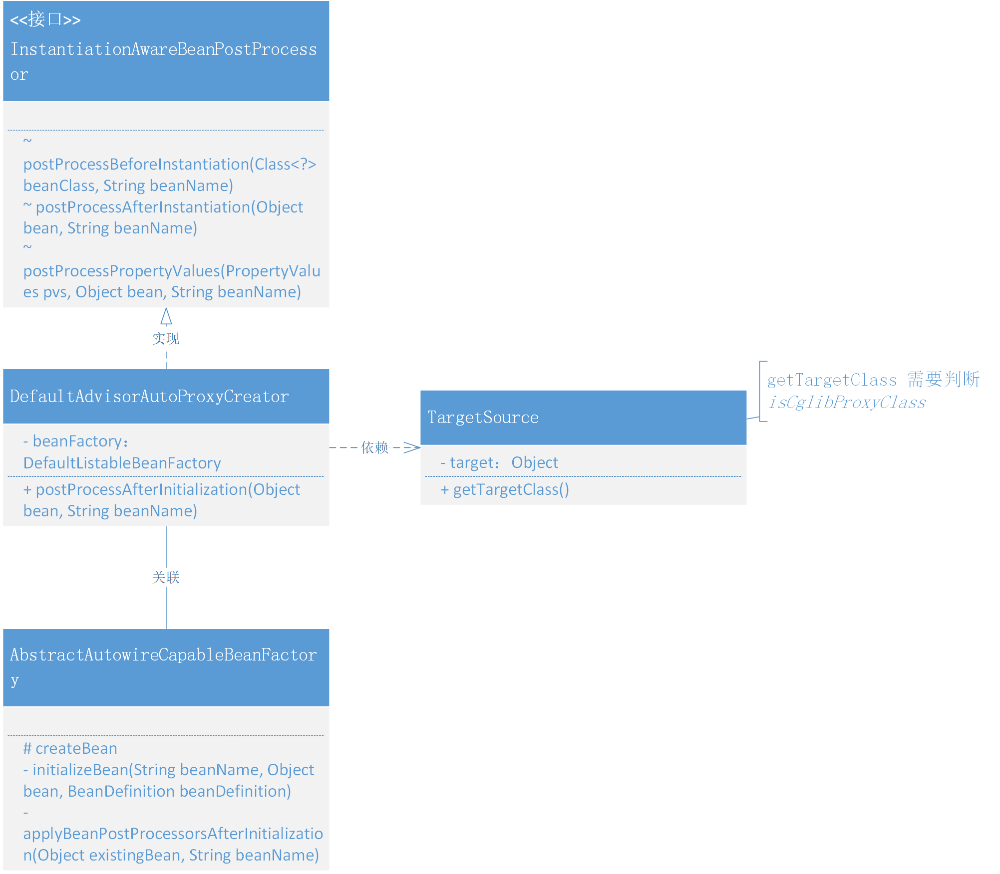

# 15. 给代理对象的属性设置值

## 1. 目标

因为在之前把`AOP动态代理，融入到Bean的生命周期`时，创建代理对象是在整个创建 Bean 对象之前，也就是说这个代理对象的创建并不是在 Bean 生命周期中。

所以本章节中我们要把代理对象的创建融入到 Bean 的生命周期中，也就是需要把创建代理对象的逻辑迁移到 Bean 对象执行初始化方法之后，在执行代理对象的创建。

## 2. 设计


- 在创建 Bean 对象 `createBean` 的生命周期中，有一个阶段是在 Bean 对象属性填充完成以后，执行 Bean 的初始化方法和 BeanPostProcessor 的前置和后置处理，例如：感知 Aware 对象、处理 init-method 方法等。那么在这个阶段的 `BeanPostProcessor After` 就可以用于创建代理对象操作。
- 在 DefaultAdvisorAutoProxyCreator 用于创建代理对象的操作中，需要把创建操作从 postProcessBeforeInstantiation 方法中迁移到 postProcessAfterInitialization，这样才能满足 Bean 属性填充后的创建操作。

## 3. 实现

### 1. 在Bean的生命周期中创建代理对象的类关系



- 虽然本章节要完成的是关于代理对象中属性的填充问题，但实际解决的思路是处理在 Bean 的生命周期中合适的位置（`初始化 initializeBean`）中处理代理类的创建。
- 所以以上的改动并不会涉及太多内容，主要包括：DefaultAdvisorAutoProxyCreator 类创建代理对象的操作放置在 postProcessAfterInitialization 方法中以及对应在 AbstractAutowireCapableBeanFactory 完成初始化方法的调用操作。
- 另外还有一点要注意，就是目前我们在 Spring 框架中，AbstractAutowireCapableBeanFactory 类里使用的是 CglibSubclassingInstantiationStrategy 创建对象，所以有需要判断对象获取接口的方法中，也都需要判断是否为 CGlib创建，否则是不能正确获取到接口的。如：`ClassUtils.isCglibProxyClass(clazz) ? clazz.getSuperclass() : clazz;`

### 2. 判断CGlib对象

```java
public class TargetSource {

    private final Object target;

    /**
     * Return the type of targets returned by this {@link TargetSource}.
     * <p>Can return <code>null</code>, although certain usages of a
     * <code>TargetSource</code> might just work with a predetermined
     * target class.
     *
     * @return the type of targets returned by this {@link TargetSource}
     */
    public Class<?>[] getTargetClass() {
        Class<?> clazz = this.target.getClass();
        clazz = ClassUtils.isCglibProxyClass(clazz) ? clazz.getSuperclass() : clazz;
        return clazz.getInterfaces();
    }

}

```

- 在 TargetSource#getTargetClass 是用于获取 target 对象的接口信息的，那么这个 target 可能是 `JDK代理` 创建也可能是 `CGlib创建`，为了保证都能正确的获取到结果，这里需要增加判读 `ClassUtils.isCglibProxyClass(clazz)`

### 3. 迁移创建AOP代理方法

```java
public class DefaultAdvisorAutoProxyCreator implements InstantiationAwareBeanPostProcessor, BeanFactoryAware {

    private DefaultListableBeanFactory beanFactory;

    @Override
    public Object postProcessBeforeInstantiation(Class<?> beanClass, String beanName) throws BeansException {
        return null;
    }

    @Override
    public Object postProcessAfterInitialization(Object bean, String beanName) throws BeansException {

        if (isInfrastructureClass(bean.getClass())) return bean;

        Collection<AspectJExpressionPointcutAdvisor> advisors = beanFactory.getBeansOfType(AspectJExpressionPointcutAdvisor.class).values();

        for (AspectJExpressionPointcutAdvisor advisor : advisors) {
            ClassFilter classFilter = advisor.getPointcut().getClassFilter();
            // 过滤匹配类
            if (!classFilter.matches(bean.getClass())) continue;

            AdvisedSupport advisedSupport = new AdvisedSupport();

            TargetSource targetSource = new TargetSource(bean);
            advisedSupport.setTargetSource(targetSource);
            advisedSupport.setMethodInterceptor((MethodInterceptor) advisor.getAdvice());
            advisedSupport.setMethodMatcher(advisor.getPointcut().getMethodMatcher());
            advisedSupport.setProxyTargetClass(false);

            // 返回代理对象
            return new ProxyFactory(advisedSupport).getProxy();
        }

        return bean;
    }  

}

```

- 关于 DefaultAdvisorAutoProxyCreator 类的操作主要就是把创建 AOP 代理的操作从 postProcessBeforeInstantiation 移动到 postProcessAfterInitialization 中去。
- 通过设置一些 AOP 的必备参数后，返回代理对象 `new ProxyFactory(advisedSupport).getProxy()` 这个代理对象中就包括间接调用了 TargetSource 中对 getTargetClass() 的获取。

### 4. 在Bean的生命周期中初始化执行

```java
public abstract class AbstractAutowireCapableBeanFactory extends AbstractBeanFactory implements AutowireCapableBeanFactory {

    private InstantiationStrategy instantiationStrategy = new CglibSubclassingInstantiationStrategy();

    @Override
    protected Object createBean(String beanName, BeanDefinition beanDefinition, Object[] args) throws BeansException {
        Object bean = null;
        try {
            // ...

            // 执行 Bean 的初始化方法和 BeanPostProcessor 的前置和后置处理方法
            bean = initializeBean(beanName, bean, beanDefinition);
        } catch (Exception e) {
            throw new BeansException("Instantiation of bean failed", e);
        }
        // ...
        return bean;
    }

    private Object initializeBean(String beanName, Object bean, BeanDefinition beanDefinition) {

        // ...

        wrappedBean = applyBeanPostProcessorsAfterInitialization(bean, beanName);
        return wrappedBean;
    }

    @Override
    public Object applyBeanPostProcessorsAfterInitialization(Object existingBean, String beanName) throws BeansException {
        Object result = existingBean;
        for (BeanPostProcessor processor : getBeanPostProcessors()) {
            Object current = processor.postProcessAfterInitialization(result, beanName);
            if (null == current) return result;
            result = current;
        }
        return result;
    }

}

```

- 在 AbstractAutowireCapableBeanFactory#createBean 方法中，其实关注点就在于 initializeBean -> applyBeanPostProcessorsAfterInitialization 这一块逻辑的调用，最终完成 AOP 代理对象的创建操作。


## 4. 测试

###  1. 事先准备

**UserService 添加属性字段**

```java
public class UserService implements IUserService {

    private String token;

    public String queryUserInfo() {
        try {
            Thread.sleep(new Random(1).nextInt(100));
        } catch (InterruptedException e) {
            e.printStackTrace();
        }
        return "小傅哥，100001，深圳，" + token;
    }

}

```

- token 是在 UserService 中新增的属性信息，用于测试代理对象的属性填充操作。

###  2. 属性配置文件

```java
<?xml version="1.0" encoding="UTF-8"?>
<beans xmlns="http://www.springframework.org/schema/beans"
       xmlns:xsi="http://www.w3.org/2001/XMLSchema-instance"
       xmlns:context="http://www.springframework.org/schema/context"
       xsi:schemaLocation="http://www.springframework.org/schema/beans
	         http://www.springframework.org/schema/beans/spring-beans.xsd
		 http://www.springframework.org/schema/context">

    <bean class="org.example.spring.beans.factory.PropertyPlaceholderConfigurer">
        <property name="location" value="classpath:token.properties"/>
    </bean>

    <bean class="org.example.spring.aop.framework.autoproxy.DefaultAdvisorAutoProxyCreator"/>

    <bean id="beforeAdvice" class="org.example.bean.UserServiceBeforeAdvice"/>

    <bean id="methodInterceptor" class="org.example.spring.aop.framework.adapter.MethodBeforeAdviceInterceptor">
        <property name="advice" ref="beforeAdvice"/>
    </bean>

    <bean id="pointcutAdvisor" class="org.example.spring.aop.aspectj.AspectJExpressionPointcutAdvisor">
        <property name="expression" value="execution(* org.example.bean.IUserService.*(..))"/>
        <property name="advice" ref="methodInterceptor"/>
    </bean>

    <context:component-scan base-package="org.example.bean"/>

</beans>
```


- 与我们对 AOP 的测试来说，唯一新增加的就是 property 的配置：`<property name="token" value="RejDlI78hu223Opo983Ds"/>`

### 3. 单元测试

```java
@Test
    public void testScan() {
        ClassPathXmlApplicationContext applicationContext = new ClassPathXmlApplicationContext("classpath:spring.xml");
        IUserService userService = applicationContext.getBean("userService", IUserService.class);
        System.out.println("测试结果：" + userService.queryUserInfo());
    }
```


**测试结果**

```java
拦截方法：queryUserInfo
测试结果：victor_G，北京，亦庄RejDlI78hu223Opo983Ds
 
    
```

- 从测试结果可以看到，通过对 Bean 生命周期的调整，在创建 AOP 代理对象就可以把代理对象的属性信息填充进去了。
- 另外这里还有一块是关于在 TargetSource#getTargetClass 中关于是否为 CGlib 的方法判断，只有这样操作才可以获取到争取的类信息