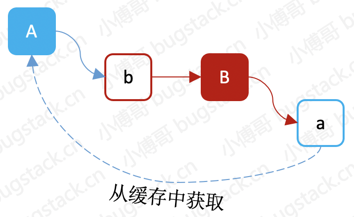

# 16. 通过三级缓存解决循环依赖

## 1. 目标

按照目前我们实现的 Spring 框架，是可以满足一个基本需求的，但如果你配置了A、B两个Bean对象互相依赖，那么立马会抛出 `java.lang.StackOverflowError`，为什么呢？因为`A创建`时需要依赖`B创建`，而B的创建又依赖于A创建，就这样死循环了。

而这个循环依赖基本也可以说是 Spring 中非常经典的实现了，所要解决的场景主要有以下三种情况：


- 循环依赖主要分为这三种，自身依赖于自身、互相循环依赖、多组循环依赖。
- 但无论循环依赖的数量有多少，循环依赖的本质是一样的。就是你的完整创建依赖于我，而我的完整创建也依赖于你，但我们互相没法解耦，最终导致依赖创建失败。
- 所以需要 Spring 提供了除了构造函数注入和原型注入外的，setter 循环依赖注入解决方案。


## 2. 设计

按照 Spring 框架的设计，用于解决循环依赖需要用到三个缓存，这三个缓存分别存放了`成品对象`、`半成品对象(未填充属性值)`、`代理对象`，分阶段存放对象内容，来解决循环依赖问题。

**那么**，这里我们需要知道一个核心的原理，就是用于解决循环依赖就必须是三级缓存呢，二级行吗？一级可以不？其实都能解决，只不过 Spring 框架的实现要保证几个事情，如只有一级缓存处理流程没法拆分，复杂度也会增加，同时半成品对象可能会有空指针异常。而将半成品与成品对象分开，处理起来也更加优雅、简单、易扩展。另外 Spring 的两大特性中不仅有 IOC 还有 AOP，也就是基于字节码增强后的方法，该存放到哪，而三级缓存最主要，要解决的循环依赖就是对 AOP 的处理，但如果把 AOP 代理对象的创建提前，那么二级缓存也一样可以解决。但是，这就违背了 Spring 创建对象的原则，Spring 更喜欢把所有的普通 Bean 都初始化完成，在处理代理对象的初始化。

**不过**，没关系我们可以先尝试仅适用一级缓存来解决循环依赖，通过这样的方式从中学习到处理循环依赖的最核心原来，也就是那20%的地方。



### 1. 一级缓存解决循环依赖

如果仅以一级缓存解决循环依赖，那么在实现上可以通过在A对象 newInstance 创建且未填充属性后，直接放入缓存中。

- 在`A对象`的属性填充`B对象`时，如果缓存中不能获取到`B对象`，则开始创建`B对象`，同样创建完成后，把`B对象`填充到缓存中去。
- 接下来就开始对`B对象`的属性进行填充，恰好这会可以从缓存中拿到`半成品的A对象`，那么这个时候`B对象`的属性就填充完了。
- 最后返回来继续完成`A对象`的属性填充，把实例化后并填充了属性的`B对象`赋值给A对象的`b属性`，这样就完成了一个循环依赖操作。

```java
private final static Map<String, Object> singletonObjects = new ConcurrentHashMap<>(256);

private static <T> T getBean(Class<T> beanClass) throws Exception {
    String beanName = beanClass.getSimpleName().toLowerCase();
    if (singletonObjects.containsKey(beanName)) {
        return (T) singletonObjects.get(beanName);
    }
    // 实例化对象入缓存
    Object obj = beanClass.newInstance();
    singletonObjects.put(beanName, obj);
    // 属性填充补全对象
    Field[] fields = obj.getClass().getDeclaredFields();
    for (Field field : fields) {
        field.setAccessible(true);
        Class<?> fieldClass = field.getType();
        String fieldBeanName = fieldClass.getSimpleName().toLowerCase();
        field.set(obj, singletonObjects.containsKey(fieldBeanName) ? singletonObjects.get(fieldBeanName) : getBean(fieldClass));
        field.setAccessible(false);
    }
    return (T) obj;
}

```

- 使用一级缓存存放对象的方式，就是这样简单的实现过程，只要是创建完对象，立马塞到缓存里去。这样就可以在其他对象创建时候获取到属性需要填充的对象了。

**测试结果**

```java
public static void main(String[] args) throws Exception {
    System.out.println(getBean(B.class).getA());
    System.out.println(getBean(A.class).getB());
}

cn.bugstack.springframework.test.A@49476842
cn.bugstack.springframework.test.B@78308db1

Process finished with exit code 0

```

- 从测试效果和截图依赖过程中可以看到，一级缓存也可以解决简单场景的循环依赖问题。
- 其实 `getBean`，是整个解决循环依赖的核心内容，A 创建后填充属性时依赖 B，那么就去创建 B，在创建 B 开始填充时发现依赖于 A，但此时 A 这个半成品对象已经存放在缓存到`singletonObjects` 中了，所以 B 可以正常创建，在通过递归把 A 也创建完整了。

### 2. 三级缓存解决循环依赖


- 关于循环依赖在我们目前的 Spring 框架中扩展起来也并不会太复杂，主要就是对于创建对象的`提前暴露`，如果是工厂对象则会使用 getEarlyBeanReference 逻辑提前将工厂🏭对象存放到三级缓存中。等到后续获取对象的时候实际拿到的是工厂对象中 getObject，这个才是最终的实际对象。
- 在创建对象的 `AbstractAutowireCapableBeanFactory#doCreateBean` 方法中，提前暴露对象以后，就可以通过接下来的流程，getSingleton 从三个缓存中以此寻找对象，一级、二级如果有则直接取走，如果对象是三级缓存中则会从三级缓存中获取后并删掉工厂对象，把实际对象放到二级缓存中。
- 最后是关于单例的对象的注册操作，这个注册操作就是把真实的实际对象放到一级缓存中，因为此时它已经是一个成品对象了。


## 3. 实现

处理循环依赖核心流程的类关系的操作过程包括：

- 循环依赖的核心功能实现主要包括 DefaultSingletonBeanRegistry 提供三级缓存：`singletonObjects`、`earlySingletonObjects`、`singletonFactories`，分别存放成品对象、半成品对象和工厂对象。同时包装三个缓存提供方法：getSingleton、registerSingleton、addSingletonFactory，这样使用方就可以分别在不同时间段存放和获取对应的对象了。
- 在 AbstractAutowireCapableBeanFactory 的 doCreateBean 方法中，提供了关于提前暴露对象的操作，`addSingletonFactory(beanName, () -> getEarlyBeanReference(beanName, beanDefinition, finalBean));`，以及后续获取对象和注册对象的操作，`exposedObject = getSingleton(beanName);`、`registerSingleton(beanName, exposedObject);`，经过这样的处理就可以完成对复杂场景循环依赖的操作。
- 另外在 DefaultAdvisorAutoProxyCreator 提供的切面服务中，也需要实现接口 InstantiationAwareBeanPostProcessor 新增的 getEarlyBeanReference 方法，便于把依赖的切面对象也能存放到三级缓存中，处理对应的循环依赖。


## 4. 测试

```java
public class Husband {

    private Wife wife;

    public String queryWife(){
        return "Husband.wife";
    }

}

```

```java
public class Wife {

    private Husband husband;
    private IMother mother; // 婆婆

    public String queryHusband() {
        return "Wife.husband、Mother.callMother：" + mother.callMother();
    }

}

```

```java
public class HusbandMother implements FactoryBean<IMother> {

    @Override
    public IMother getObject() throws Exception {
        return (IMother) Proxy.newProxyInstance(Thread.currentThread().getContextClassLoader(), new Class[]{IMother.class}, (proxy, method, args) -> "婚后媳妇妈妈的职责被婆婆代理了！" + method.getName());
    }

}

```

```java
public class SpouseAdvice implements MethodBeforeAdvice {

    @Override
    public void before(Method method, Object[] args, Object target) throws Throwable {
        System.out.println("关怀小两口(切面)：" + method);
    }

}

```

```xml
<?xml version="1.0" encoding="UTF-8"?>
<beans xmlns="http://www.springframework.org/schema/beans"
       xmlns:xsi="http://www.w3.org/2001/XMLSchema-instance"
       xsi:schemaLocation="http://www.springframework.org/schema/beans
	         http://www.springframework.org/schema/beans/spring-beans.xsd">

    <bean id="husband" class="org.example.bean.Husband">
        <property name="wife" ref="wife"/>
    </bean>

    <bean id="wife" class="org.example.bean.Wife">
        <property name="husband" ref="husband"/>
        <property name="mother" ref="husbandMother"/>
    </bean>

    <bean id="husbandMother" class="org.example.bean.HusbandMother"/>

    <!-- AOP 配置，验证三级缓存 -->
    <bean class="org.example.spring.aop.framework.autoproxy.DefaultAdvisorAutoProxyCreator"/>

    <bean id="beforeAdvice" class="org.example.bean.SpouseAdvice"/>

    <bean id="methodInterceptor" class="org.example.spring.aop.framework.adapter.MethodBeforeAdviceInterceptor">
        <property name="advice" ref="beforeAdvice"/>
    </bean>

    <bean id="pointcutAdvisor" class="org.example.spring.aop.aspectj.AspectJExpressionPointcutAdvisor">
        <property name="expression" value="execution(* org.example.bean.Wife.*(..))"/>
        <property name="advice" ref="methodInterceptor"/>
    </bean>

</beans>
```

```java
   @Test
    public void testCircular() {
        ClassPathXmlApplicationContext applicationContext = new ClassPathXmlApplicationContext("classpath:spring.xml");
        Husband husband = applicationContext.getBean("husband", Husband.class);
        Wife wife = applicationContext.getBean("wife", Wife.class);
        System.out.println("老公的媳妇：" + husband.queryWife());
        System.out.println("媳妇的老公：" + wife.queryHusband());
    }
```

```txt
老公的媳妇：Husband.wife
关怀小两口(切面)：public java.lang.String org.example.bean.Wife.queryHusband()
媳妇的老公：Wife.husband、Mother.callMother：婚后媳妇妈妈的职责被婆婆代理了！callMother

Process finished with exit code 0

```

- 从测试结果可以看到，无论是简单对象依赖 *老公依赖媳妇、媳妇依赖老公*，还是代理工程对象或者 AOP 切面对象都可以在三级缓存下解决循环依赖的问题了。
- 此外从运行截图 `DefaultSingletonBeanRegistry#getSingleton` 中也可以看到凡事需要三级缓存存放工厂对象的类，都会使用到 getObject 获取真实对象，并随后存入半成品对象 earlySingletonObjects 中以及移除工厂对象。

## 5. 三级缓存的必要性

Spring在属性注入时有两种方式，一种是实例化对象时同个构造器进行注入，这种情况如果产生循环依赖是没用办法解决的。另一种是实例化之后，来到属性填充流程，通过反射完成属性的注入，这种方式也会产生循环依赖问题，Spring中引用了三级缓存用于解决循环依赖。所以三级缓存只能解决特定场景下的循环依赖，一些场景是没办法解决的，如构造器注入、多例等。

### Spring中循环依赖场景

构造器循环依赖：Spring实例化过程中，会计算获取合适的构造函数，如果获取的构造器是一个有参的，此时的入参恰好也有该实例的场景，如实例化A时，构造器需要传入B，这时会先从三级缓存中获取；如果获取不到则会创建B，而创建B的过程中如果恰好使用的构造器是需要传入A的，这时尝试从缓存中获取，由于A还未被创建，所以此时获取不到，再去创建A就形成的闭环，陷入死循环了。如果创建B时，使用的是无参构造器，那么B是可以成功创建出来的，但是在B的属性填充环节又需要用到A，这也会产生循环依赖；构造器循环依赖时，无法解决；


原型模式（多例）循环依赖：Spring在每次从获取Bean时，如果是多例则不会尝试从缓存中获取，每次都会创建一个新的Bean对象进行返回，而在创建时其属性中也有引用Bean本身的情况，如A中有属性B，其两者为原型模式。这样在创建A过程时会尝试获取B，由于是多例的，获取B时又会先创建A，这样就形成闭环，产生循环依赖问题；原型模式（多例）循环依赖时，无法解决。


DependsOn循环依赖：如果使用了DependsOn，则Spring在创建当前Bean之前，会先创建所依赖的Bean。如果依赖的Bean也依赖其本身或依赖的Bean的子孙们也依赖其本身也会产生循环依赖问题，如A依赖B，B依赖A；A依赖B，B依赖C，C依赖A；使用三级缓存可以解决此循环依赖问题。


单例属性填充循环依赖：Spring在完成Bean的实例化之后，会调用populateBean方法，该方法中会对Bean属性进行注入，通过反射的方式使用set注入。这里并不是所有属性都会进行注入，只有进行配置的属性才会进行注入，如使用@Autowire会尝试从BeanFactory中进行获取注入。populateBean过程发生的问题跟上述发生的差不多，使用三级缓存可以解决此循环依赖问题。


单例代理对象循环依赖：当我们使用@Async注解时，会生成一个新的代理对象。此时如果被代理类中属性类也引用了被代理类，则会出行循环依赖问题；使用三级缓存可以解决此循环依赖问题。

```
@Service
public class TestService1 {
 
    @Autowired
    private TestService2 testService2;
 
    public void test1() {
    }
@Service
public class TestService2 {
 
    @Autowired
    private TestService1 testService1;
 
    public void test2() {
    }
```

### Spirng中的三级缓存

```
    protected Object getSingleton(String beanName, boolean allowEarlyReference) {
        Object singletonObject = this.singletonObjects.get(beanName);
        if (singletonObject == null && isSingletonCurrentlyInCreation(beanName)) {
            synchronized (this.singletonObjects) {
                singletonObject = this.earlySingletonObjects.get(beanName);
                if (singletonObject == null && allowEarlyReference) {
                    ObjectFactory<?> singletonFactory = this.singletonFactories.get(beanName);
                    if (singletonFactory != null) {
                        singletonObject = singletonFactory.getObject();
                        this.earlySingletonObjects.put(beanName, singletonObject);
                        this.singletonFactories.remove(beanName);
                    }
                }
            }
        }
        return singletonObject;
    }
```

该方法是Spring尝试从缓存中获取实例化后的对象过程，其中可以看到有三个缓存对象。


singletonObjects：一级缓存，存放成品对象，也就是完成了实例化、属性注入、初始化（如代理对象生成）等过程的完整对象；

earlySingletonObjects：二级缓存，存入实例化后还未进入属性注入，初始化方法调用的半成品对象；

singletonFactories：三级缓存，该缓存是存入ObjectFactory，并不是真正的bean对象，当通过beanName从三级缓存中获取了ObjectFactory的实现类之后，通过其getObject()方法获取真正的对象，返回的对象可能是代理后的对象，也可能是原生对象。

getSingleton方法首先会尝试从一级缓存中获取完整的对象，获取到则返回；如果获取不到则从二级缓存中获取，获取到则返回；如果二级缓存中也获取不到对象，则尝试从三级缓存中获取对象，此时获取到的对象是ObjectFactory对象，需要调用其getObject方法获取真正的对象，获取到之后存入二级缓存，移除三级缓存；下次获取可直接从二级缓存中获取。

### Spring一级缓存解决循环依赖

当只有一级缓存时，发生了循环依赖。以A类有属性B，B类有属性A为例；


1.当实例化A之后，将A添加到一级缓存中，后进入属性注入流程；

2.在发现B需要被注入，此时会去一级缓存中查找B，查询不到则进行创建；

3.创建B之后，加入到一级缓存中。在进行属性注入时，发现需要A，此时会去一级缓存中查找A；

4.由于步骤1中一级缓存有A了，所以此时获取到A后进行属性注入，这时的B就是一个完整的对象。

A获取到新创建的B之后，进行注入，此时A也是一个完整的对象了。

通过以上步骤，我们可以得出对于单例模式下，一级缓存是可以解决循环依赖的；但是这种方式是将半成品跟成品对象放在一块了，假设我们对SpringIOC进行拓展，实现新的上下文时，如果存在多线程的情况，当获取到一个半成品，调用其方法时，就会报空指针异常了，所以只使用一级缓存是很不友好的，拓展性太差了。

### Spring二级缓存解决循环依赖

由于一级缓存的缺点，半成品跟成品Bean都混在一块，导致拓展性差的问题。使用二级缓存就可以解决一级缓存中的问题。


1.一级缓存存放完整对象、二级缓存存放半成品对象

2.我们在属性注入时，尝试获取所需的Bean，先从一级缓存中查找，查询不到再从二级缓存中进行查询。

通过二级缓存的方式，拓展性有所提升。但是二级缓存也是有所缺陷。


1.A是一个需要被代理的对象，Spring IOC会先创建原始对象，在属性注入之后的初始化环节中才会对其进行代理。

2.创建普通的对象A之后，加入二级缓存中；属性注入时需要B，此时会创建B，B创建之后加入二级缓存。

3.B属性注入时，需要用到A，此时会去二级缓存中查找A，找到后进行注入，并加入到一级缓存中，移除二级缓存。

4.A获取到B之后，进行属性注入。注入完成后进入到初始化环节，调用BeanPostProcessor的postProcessAfterInitialization中生成代理对象EnhanceA;

大家是否发现B对象属性A是一个原生对象，并不是代理后的EnhanceA对象，所以这里就有问题了，二级缓存没办法解决代理的问题。

### Spring三级缓存解决循环依赖

基于二级缓存的缺陷，这里Spring IOC引入了三级缓存。三级缓存存入的是一个ObjectFactory，并不是真正的Bean对象。

```java
@FunctionalInterface
public interface ObjectFactory<T> {

	/**
	 * Return an instance (possibly shared or independent)
	 * of the object managed by this factory.
	 * @return the resulting instance
	 * @throws BeansException in case of creation errors
	 */
	T getObject() throws BeansException;

}
```


我们可以看到ObjectFactory有getObject方法，在三级缓存中获取到ObjectFactory类型对象后，通过调用其getObject方法返回真正的Bean对象

1. 创建A之后，创建一个匿名内部类的FactoryBean存入三级缓存中。

```
            addSingletonFactory(beanName, () -> getEarlyBeanReference(beanName, mbd, bean));
    protected Object getEarlyBeanReference(String beanName, RootBeanDefinition mbd, Object bean) {
        Object exposedObject = bean;
        if (!mbd.isSynthetic() && hasInstantiationAwareBeanPostProcessors()) {
            for (BeanPostProcessor bp : getBeanPostProcessors()) {
                if (bp instanceof SmartInstantiationAwareBeanPostProcessor) {
                    SmartInstantiationAwareBeanPostProcessor ibp = (SmartInstantiationAwareBeanPostProcessor) bp;
                    exposedObject = ibp.getEarlyBeanReference(exposedObject, beanName);
                }
            }
        }
        return exposedObject;
    }
```

从匿名内部类的代码实现，首先从BeanFactory工厂中获取所有的BeanPostProcessor ，如果SmartInstantiationAwareBeanPostProcessor 类型的则调用其getEarlyBeanReference方法。而是否会被代理，就看SmartInstantiationAwareBeanPostProcessor 中是否有加载代理生成的工具类（在Spring IOC的准备工作中创建的）。

创建B之后，加入三级缓存。从一级缓存中查询，查不到从二级缓存中查询，查不到从三级缓存中查询。查询到之后，根据beanName名称获取到ObjectFactory对象，并调用getObject方法，最终会得到真正的bean对象。该bean对象可能是代理对象也可能不是，要看具体的配置。从三级缓存中获取到对象之后，将该对象加入到二级缓存中，移除三级缓存，因为每次调用三级缓存可能开销是很大的。

3.B 获取到代理对象A之后进行属性注入，此时B就是一个完整的对象了，将二级缓存、三级缓存中的半成品移除，并将完整的对象加入到一级缓存中。

4、A获取到创建的B进行属性注入后，加入一级缓存中，移除二级、三级缓存。

通过以上步骤我们可以看到就能够解决二级缓存的缺陷了；可能有读者会有疑惑：

**为什么不直接创建代理对象之后直接放入二级缓存呢？**

如果直接放入二级缓存中也是没有问题的，但是需要考虑到代理的创建过程是及其耗时的，所以这里相当于采用懒加载的方法，当需要用到时再去进行创建，避免容器启动时，大量对象的创建，导致内存泄露等问题。

**三级缓存中调用了代理对象，在初始化流程中还会进行代理吗？**

在第一次创建代理之后会放入代理缓存中，当下次进行代理时，会尝试从缓存中获取，获取到了直接返回即可；

