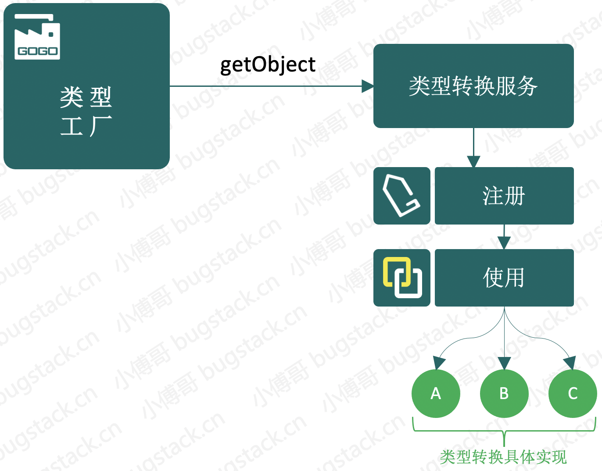

# 17. 数据类型转换工厂设计实现

## 1. 目标

类型转换也可以叫做数据转换，比如从String到Integer、从String到Date、从Dubbo到Long等等，但这些操作不能在已经使用框架的情况下还需要手动处理，所以我们要把这样的功能扩展到Spring框架中。

## 2. 设计



- 首先从工厂出发我们需要实现一个 `ConversionServiceFactoryBean` 来对类型转换服务进行操作。
- 而实现类型转换的服务，需要定义 `Converter` 转换类型、`ConverterRegistry` 注册类型转换功能，另外转换类型的操作较多，所以这里也会需要定义一个类型转换工厂 `ConverterFactory` 各个具体的转换操作来实现这个工厂接口。


## 3. 实现

### 2. 定义类型转换接口

**类型转换处理接口**

```java
public interface Converter<S, T>  {

    /** Convert the source object of type {@code S} to target type {@code T}. */
    T convert(S source);

}

```

**类型转换工厂**

```java
public interface ConverterFactory<S, R>{

    /**
     * Get the converter to convert from S to target type T, where T is also an instance of R.
     * @param <T> the target type
     * @param targetType the target type to convert to
     * @return a converter from S to T
     */
    <T extends R> Converter<S, T> getConverter(Class<T> targetType);

}

```

**类型转换注册接口**

```java
public interface ConverterRegistry {

    /**
     * Add a plain converter to this registry.
     * The convertible source/target type pair is derived from the Converter's parameterized types.
     * @throws IllegalArgumentException if the parameterized types could not be resolved
     */
    void addConverter(Converter<?, ?> converter);

    /**
     * Add a generic converter to this registry.
     */
    void addConverter(GenericConverter converter);

    /**
     * Add a ranged converter factory to this registry.
     * The convertible source/target type pair is derived from the ConverterFactory's parameterized types.
     * @throws IllegalArgumentException if the parameterized types could not be resolved
     */
    void addConverterFactory(ConverterFactory<?, ?> converterFactory);

}

```

- Converter、ConverterFactory、ConverterRegistry，都是用于定义类型转换操作的相关接口，后续所有的实现都需要围绕这些接口来实现，具体的代码功能可以进行调试验证。

### 3. 实现类型转换服务

```java
public class DefaultConversionService extends GenericConversionService{

    public DefaultConversionService() {
        addDefaultConverters(this);
    }

    public static void addDefaultConverters(ConverterRegistry converterRegistry) {
        // 添加各类类型转换工厂
        converterRegistry.addConverterFactory(new StringToNumberConverterFactory());
    }

}

```

- DefaultConversionService 是继承 GenericConversionService 的实现类，而 GenericConversionService 实现了 ConversionService, ConverterRegistry 两个接口，用于 canConvert 判断和转换接口 convert 操作。

### 4. 创建类型转换工厂

```java
public class ConversionServiceFactoryBean implements FactoryBean<ConversionService>, InitializingBean {

    @Nullable
    private Set<?> converters;

    @Nullable
    private GenericConversionService conversionService;

    @Override
    public ConversionService getObject() throws Exception {
        return conversionService;
    }

    @Override
    public Class<?> getObjectType() {
        return conversionService.getClass();
    }

    @Override
    public boolean isSingleton() {
        return true;
    }

    @Override
    public void afterPropertiesSet() throws Exception {
        this.conversionService = new DefaultConversionService();
        registerConverters(converters, conversionService);
    }

    private void registerConverters(Set<?> converters, ConverterRegistry registry) {
        if (converters != null) {
            for (Object converter : converters) {
                if (converter instanceof GenericConverter) {
                    registry.addConverter((GenericConverter) converter);
                } else if (converter instanceof Converter<?, ?>) {
                    registry.addConverter((Converter<?, ?>) converter);
                } else if (converter instanceof ConverterFactory<?, ?>) {
                    registry.addConverterFactory((ConverterFactory<?, ?>) converter);
                } else {
                    throw new IllegalArgumentException("Each converter object must implement one of the " +
                            "Converter, ConverterFactory, or GenericConverter interfaces");
                }
            }
        }
    }

    public void setConverters(Set<?> converters) {
        this.converters = converters;
    }

}

```

- 有了 FactoryBean 的实现就可以完成工程对象的操作，可以提供出转换对象的服务 GenericConversionService，另外在 afterPropertiesSet 中调用了注册转换操作的类。最终这个类会被配置到 spring.xml 中在启动的过程加载。

### 5. 类型转换服务使用

```java
protected void applyPropertyValues(String beanName, Object bean, BeanDefinition beanDefinition) {
    try {
        PropertyValues propertyValues = beanDefinition.getPropertyValues();
        for (PropertyValue propertyValue : propertyValues.getPropertyValues()) {
            String name = propertyValue.getName();
            Object value = propertyValue.getValue();
            if (value instanceof BeanReference) {
                // A 依赖 B，获取 B 的实例化
                BeanReference beanReference = (BeanReference) value;
                value = getBean(beanReference.getBeanName());
            }
            // 类型转换
            else {
                Class<?> sourceType = value.getClass();
                Class<?> targetType = (Class<?>) TypeUtil.getFieldType(bean.getClass(), name);
                ConversionService conversionService = getConversionService();
                if (conversionService != null) {
                    if (conversionService.canConvert(sourceType, targetType)) {
                        value = conversionService.convert(value, targetType);
                    }
                }
            }
            // 反射设置属性填充
             BeanUtil.setFieldValue(bean, name, value);
        }
    } catch (Exception e) {
        throw new BeansException("Error setting property values：" + beanName + " message：" + e);
    }
}

```

- 在 AbstractAutowireCapableBeanFactory#applyPropertyValues 填充属性的操作中，具体使用了类型转换的功能。
- 在 AutowiredAnnotationBeanPostProcessor#postProcessPropertyValues 也有同样的属性类型转换操作。


## 4. 测试

```java
public class Husband {

    private String wifiName;

    private Date marriageDate; // 添加一个日期类的转换操作
 		
    // ... get/set
}    

```

```java
public class StringToLocalDateConverter implements Converter<String, LocalDate> {

	private final DateTimeFormatter DATE_TIME_FORMATTER;

	public StringToLocalDateConverter(String pattern) {
		DATE_TIME_FORMATTER = DateTimeFormatter.ofPattern(pattern);
	}

	@Override
	public LocalDate convert(String source) {
		return LocalDate.parse(source, DATE_TIME_FORMATTER);
	}

}

```

- Husband 是一个基础对象类设置了时间属性，之后再添加一个类型转换的操作用于转换时间信息。

```java
<?xml version="1.0" encoding="UTF-8"?>
<beans xmlns="http://www.springframework.org/schema/beans"
       xmlns:xsi="http://www.w3.org/2001/XMLSchema-instance"
       xsi:schemaLocation="http://www.springframework.org/schema/beans
	         http://www.springframework.org/schema/beans/spring-beans.xsd">

    <bean id="husband" class="org.example.bean.Husband">
        <property name="wifiName" value="你猜"/>
        <property name="marriageDate" value="2021-08-08"/>
    </bean>

    <bean id="conversionService" class="org.example.spring.context.support.ConversionServiceFactoryBean">
        <property name="converters" ref="converters"/>
    </bean>

    <bean id="converters" class="org.example.converter.ConvertersFactoryBean"/>

</beans>
```

```java
public class ApiTest {

    @Test
    public void testConvert() {
        ClassPathXmlApplicationContext applicationContext = new ClassPathXmlApplicationContext("classpath:spring.xml");
        Husband husband = applicationContext.getBean("husband", Husband.class);
        System.out.println("测试结果：" + husband);
    }

    @Test
    public void testStringToIntegerConverter() {
        StringToIntegerConverter converter = new StringToIntegerConverter();
        Integer num = converter.convert("1234");
        System.out.println("测试结果：" + num);
    }

    @Test
    public void testStringToNumberConverterFactory() {
        StringToNumberConverterFactory converterFactory = new StringToNumberConverterFactory();

        Converter<String, Integer> stringToIntegerConverter = converterFactory.getConverter(Integer.class);
        System.out.println("测试结果：" + stringToIntegerConverter.convert("1234"));

        Converter<String, Long> stringToLongConverter = converterFactory.getConverter(Long.class);
        System.out.println("测试结果：" + stringToLongConverter.convert("1234"));
    }

}
```

