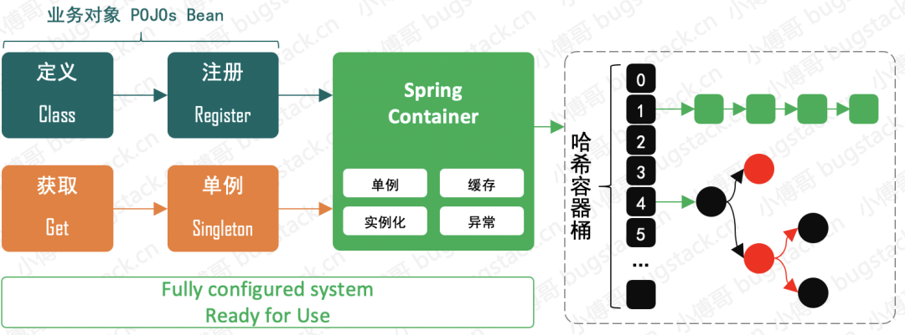
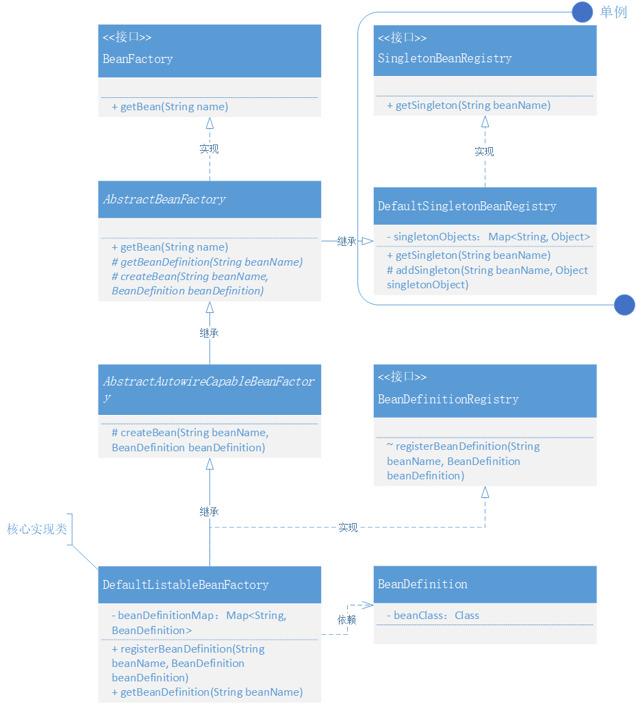
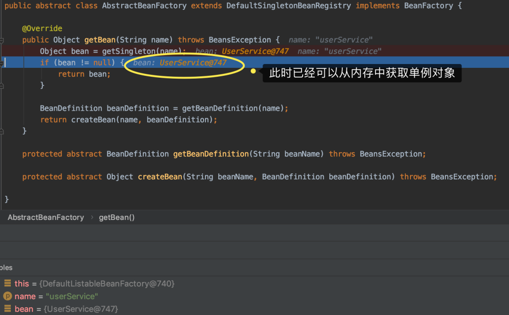

# 2. 运用设计模式，实现 Bean 的定义、注册、获取

## 1. 目标

1. bean的类型为object ，如何解决类型转换的问题？
2. 单例bean如何实现？
3. 扩展性如何实现？


## 2. 设计



- 首先我们需要定义 BeanFactory 这样一个 Bean 工厂，提供 Bean 的获取方法 `getBean(String name)`，之后这个 Bean 工厂接口由抽象类 AbstractBeanFactory 实现。这样使用模板模式的设计方式，可以统一收口通用核心方法的调用逻辑和标准定义，也就很好的控制了后续的实现者不用关心调用逻辑，按照统一方式执行。那么类的继承者只需要关心具体方法的逻辑实现即可。
- 那么在继承抽象类 AbstractBeanFactory 后的 AbstractAutowireCapableBeanFactory 就可以实现相应的抽象方法了，因为 AbstractAutowireCapableBeanFactory 本身也是一个抽象类，所以它只会实现属于自己的抽象方法，其他抽象方法由继承 AbstractAutowireCapableBeanFactory 的类实现。这里就体现了类实现过程中的各司其职，你只需要关心属于你的内容，不是你的内容，不要参与。*这一部分内容我们会在代码里有具体的体现*
- 另外这里还有块非常重要的知识点，就是关于单例 SingletonBeanRegistry 的接口定义实现，而 DefaultSingletonBeanRegistry 对接口实现后，会被抽象类 AbstractBeanFactory 继承。现在 AbstractBeanFactory 就是一个非常完整且强大的抽象类了，也能非常好的体现出它对模板模式的抽象定义。*接下来我们就带着这些设计层面的思考，去看代码的具体实现结果*

## 3. 实现

### 1. Spring Bean 容器类关系



- BeanFactory 的定义由 AbstractBeanFactory 抽象类实现接口的 getBean 方法
- 而 AbstractBeanFactory 又继承了实现了 SingletonBeanRegistry 的DefaultSingletonBeanRegistry 类。这样 AbstractBeanFactory 抽象类就具备了单例 Bean 的注册功能。
- AbstractBeanFactory 中又定义了两个抽象方法：getBeanDefinition(String beanName)、createBean(String beanName, BeanDefinition beanDefinition) ，而这两个抽象方法分别由 DefaultListableBeanFactory、AbstractAutowireCapableBeanFactory 实现。
- 最终 DefaultListableBeanFactory 还会继承抽象类 AbstractAutowireCapableBeanFactory 也就可以调用抽象类中的 createBean 方法了。

### 2. BeanDefinition 定义

**cn.bugstack.springframework.beans.factory.config.BeanDefinition**

```
public class BeanDefinition {

    private Class beanClass;

    public BeanDefinition(Class beanClass) {
        this.beanClass = beanClass;
    }
    // ...get/set
}
```

- 在 Bean 定义类中已经把上一章节中的 Object bean 替换为 Class，这样就可以把 Bean 的实例化操作放到容器中处理了。*如果你有仔细阅读过上一章并做了相应的测试，那么你会发现 Bean 的实例化操作是放在初始化调用阶段传递给 BeanDefinition 构造函数的。*

### 3. 单例注册接口定义和实现

```
public interface SingletonBeanRegistry {

    Object getSingleton(String beanName);

}
```

- 这个类比较简单主要是定义了一个获取单例对象的接口。

```
public class DefaultSingletonBeanRegistry implements SingletonBeanRegistry {

    private Map<String, Object> singletonObjects = new HashMap<>();

    @Override
    public Object getSingleton(String beanName) {
        return singletonObjects.get(beanName);
    }

    protected void addSingleton(String beanName, Object singletonObject) {
        singletonObjects.put(beanName, singletonObject);
    }

}
```

- 在 DefaultSingletonBeanRegistry 中主要实现 getSingleton 方法，同时实现了一个受保护的 addSingleton 方法，这个方法可以被继承此类的其他类调用。包括：AbstractBeanFactory 以及继承的 DefaultListableBeanFactory 调用。

### 4. 抽象类定义模板方法(AbstractBeanFactory)

```
public abstract class AbstractBeanFactory extends DefaultSingletonBeanRegistry implements BeanFactory {

    @Override
    public Object getBean(String name) throws BeansException {
        Object bean = getSingleton(name);
        if (bean != null) {
            return bean;
        }

        BeanDefinition beanDefinition = getBeanDefinition(name);
        return createBean(name, beanDefinition);
    }

    protected abstract BeanDefinition getBeanDefinition(String beanName) throws BeansException;

    protected abstract Object createBean(String beanName, BeanDefinition beanDefinition) throws BeansException;

}
```

- AbstractBeanFactory 首先继承了 DefaultSingletonBeanRegistry，也就具备了使用单例注册类方法。
- 接下来很重要的一点是关于接口 BeanFactory 的实现，在方法 getBean 的实现过程中可以看到，主要是对单例 Bean 对象的获取以及在获取不到时需要拿到 Bean 的定义做相应 Bean 实例化操作。那么 getBean 并没有自身的去实现这些方法，而是只定义了调用过程以及提供了抽象方法，由实现此抽象类的其他类做相应实现。
- 后续继承抽象类 AbstractBeanFactory 的类有两个，包括：AbstractAutowireCapableBeanFactory、DefaultListableBeanFactory，这两个类分别做了相应的实现处理，接着往下看。

### 5. 实例化Bean类(AbstractAutowireCapableBeanFactory)

```
public abstract class AbstractAutowireCapableBeanFactory extends AbstractBeanFactory {

    @Override
    protected Object createBean(String beanName, BeanDefinition beanDefinition) throws BeansException {
        Object bean = null;
        try {
            bean = beanDefinition.getBeanClass().newInstance();
        } catch (InstantiationException | IllegalAccessException e) {
            throw new BeansException("Instantiation of bean failed", e);
        }

        addSingleton(beanName, bean);
        return bean;
    }

}
```

- 在 AbstractAutowireCapableBeanFactory 类中实现了 Bean 的实例化操作 `newInstance`，其实这块会埋下一个坑，有构造函数入参的对象怎么处理？*可以提前思考*
- 在处理完 Bean 对象的实例化后，直接调用 `addSingleton` 方法存放到单例对象的缓存中去。

### 6. 核心类实现(DefaultSingletonBeanRegistry)

```
public class DefaultListableBeanFactory extends AbstractAutowireCapableBeanFactory implements BeanDefinitionRegistry {

    private Map<String, BeanDefinition> beanDefinitionMap = new HashMap<>();

    @Override
    public void registerBeanDefinition(String beanName, BeanDefinition beanDefinition) {
        beanDefinitionMap.put(beanName, beanDefinition);
    }

    @Override
    public BeanDefinition getBeanDefinition(String beanName) throws BeansException {
        BeanDefinition beanDefinition = beanDefinitionMap.get(beanName);
        if (beanDefinition == null) throw new BeansException("No bean named '" + beanName + "' is defined");
        return beanDefinition;
    }

}
```

- DefaultListableBeanFactory 在 Spring 源码中也是一个非常核心的类，在我们目前的实现中也是逐步贴近于源码，与源码类名保持一致。
- DefaultListableBeanFactory 继承了 AbstractAutowireCapableBeanFactory 类，也就具备了接口 BeanFactory 和 AbstractBeanFactory 等一连串的功能实现。*所以有时候你会看到一些类的强转，调用某些方法，也是因为你强转的类实现接口或继承了某些类。*
- 除此之外这个类还实现了接口 BeanDefinitionRegistry 中的 registerBeanDefinition(String beanName, BeanDefinition beanDefinition) 方法，当然你还会看到一个 getBeanDefinition 的实现，这个方法我们文中提到过它是抽象类 AbstractBeanFactory 中定义的抽象方法。*现在注册Bean定义与获取Bean定义就可以同时使用了，是不感觉这个套路还蛮深的。接口定义了注册，抽象类定义了获取，都集中在 DefaultListableBeanFactory 中的 beanDefinitionMap 里*

## 4. 测试

### 1. 事先准备

```
public class UserService {

    public void queryUserInfo(){
        System.out.println("查询用户信息");
    }

}
```

- 这里简单定义了一个 UserService  对象，方便我们后续对 Spring 容器测试。

### 2. 测试用例

```
@Test
public void test_BeanFactory(){
    // 1.初始化 BeanFactory
    DefaultListableBeanFactory beanFactory = new DefaultListableBeanFactory();
    // 2.注册 bean
    BeanDefinition beanDefinition = new BeanDefinition(UserService.class);
    beanFactory.registerBeanDefinition("userService", beanDefinition);
    // 3.第一次获取 bean
    UserService userService = (UserService) beanFactory.getBean("userService");
    userService.queryUserInfo();
    // 4.第二次获取 bean from Singleton
    UserService userService_singleton = (UserService) beanFactory.getBean("userService");
    userService_singleton.queryUserInfo();
}
```

- 在此次的单元测试中除了包括；Bean 工厂、注册 Bean、获取 Bean，三个步骤，还额外增加了一次对象的获取和调用。这里主要测试验证单例对象的是否正确的存放到了缓存中。
- 此外与上一章节测试过程中不同的是，我们把 UserService.class 传递给了 BeanDefinition 而不是像上一章节那样直接 new UserService() 操作。

### 3. 测试结果

```
查询用户信息
查询用户信息

Process finished with exit code 0
```

- 这里会有两次测试信息，一次是获取 Bean 时直接创建的对象，另外一次是从缓存中获取的实例化对象。

- 此外从调试的截图中也可以看到第二次获取单例对象，已经可以从内存中获取了，如图 3-3

  

- 到这本章节的功能实现和测试验证就完成了，关于测试过程中可以再去断点调试下各个阶段类的调用，熟悉调用关系。