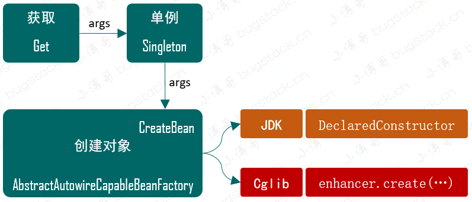

# 3. 基于Cglib实现含构造函数的类实例化策略

## 1. 目标

如果遇到一个只有有参构造的类，如何解决？

## 2. 设计



## 3. 实现

### 1. Spring Bean 容器类关系


### 2. 新增 getBean 接口

```
public interface BeanFactory {

    Object getBean(String name) throws BeansException;

    Object getBean(String name, Object... args) throws BeansException;

}
```

- BeanFactory 中我们重载了一个含有入参信息 args 的 getBean 方法，这样就可以方便的传递入参给构造函数实例化了。

### 3. 定义实例化策略接口

```
public interface InstantiationStrategy {

    Object instantiate(BeanDefinition beanDefinition, String beanName, Constructor ctor, Object[] args) throws BeansException;

}
```

- 在实例化接口 instantiate 方法中添加必要的入参信息，包括：beanDefinition、 beanName、ctor、args
- 其中 Constructor 你可能会有一点陌生，它是 java.lang.reflect 包下的 Constructor 类，里面包含了一些必要的类信息，有这个参数的目的就是为了拿到符合入参信息相对应的构造函数。
- 而 args 就是一个具体的入参信息了，最终实例化时候会用到。

### 4. JDK 实例化

```
public class SimpleInstantiationStrategy implements InstantiationStrategy {

    @Override
    public Object instantiate(BeanDefinition beanDefinition, String beanName, Constructor ctor, Object[] args) throws BeansException {
        Class clazz = beanDefinition.getBeanClass();
        try {
            if (null != ctor) {
                return clazz.getDeclaredConstructor(ctor.getParameterTypes()).newInstance(args);
            } else {
                return clazz.getDeclaredConstructor().newInstance();
            }
        } catch (NoSuchMethodException | InstantiationException | IllegalAccessException | InvocationTargetException e) {
            throw new BeansException("Failed to instantiate [" + clazz.getName() + "]", e);
        }
    }

}
```

- 首先通过 beanDefinition 获取 Class 信息，这个 Class 信息是在 Bean 定义的时候传递进去的。
- 接下来判断 ctor 是否为空，如果为空则是无构造函数实例化，否则就是需要有构造函数的实例化。
- 这里我们重点关注有构造函数的实例化，实例化方式为 `clazz.getDeclaredConstructor(ctor.getParameterTypes()).newInstance(args);`，把入参信息传递给 newInstance 进行实例化。

### 5. Cglib 实例化

```
public class CglibSubclassingInstantiationStrategy implements InstantiationStrategy {

    @Override
    public Object instantiate(BeanDefinition beanDefinition, String beanName, Constructor ctor, Object[] args) throws BeansException {
        Enhancer enhancer = new Enhancer();
        enhancer.setSuperclass(beanDefinition.getBeanClass());
        enhancer.setCallback(new NoOp() {
            @Override
            public int hashCode() {
                return super.hashCode();
            }
        });
        if (null == ctor) return enhancer.create();
        return enhancer.create(ctor.getParameterTypes(), args);
    }

}
```

- 其实 Cglib 创建有构造函数的 Bean 也非常方便，在这里我们更加简化的处理了，如果你阅读 Spring 源码还会看到 CallbackFilter 等实现，不过我们目前的方式并不会影响创建。

### 6. 创建策略调用

```
public abstract class AbstractAutowireCapableBeanFactory extends AbstractBeanFactory {

    private InstantiationStrategy instantiationStrategy = new CglibSubclassingInstantiationStrategy();

    @Override
    protected Object createBean(String beanName, BeanDefinition beanDefinition, Object[] args) throws BeansException {
        Object bean = null;
        try {
            bean = createBeanInstance(beanDefinition, beanName, args);
        } catch (Exception e) {
            throw new BeansException("Instantiation of bean failed", e);
        }

        addSingleton(beanName, bean);
        return bean;
    }

    protected Object createBeanInstance(BeanDefinition beanDefinition, String beanName, Object[] args) {
        Constructor constructorToUse = null;
        Class<?> beanClass = beanDefinition.getBeanClass();
        Constructor<?>[] declaredConstructors = beanClass.getDeclaredConstructors();
        for (Constructor ctor : declaredConstructors) {
            if (null != args && ctor.getParameterTypes().length == args.length) {
                constructorToUse = ctor;
                break;
            }
        }
        return getInstantiationStrategy().instantiate(beanDefinition, beanName, constructorToUse, args);
    }

}
```

- 首先在 AbstractAutowireCapableBeanFactory 抽象类中定义了一个创建对象的实例化策略属性类 `InstantiationStrategy instantiationStrategy`，这里我们选择了 Cglib 的实现类。
- 接下来抽取 `createBeanInstance` 方法，在这个方法中需要注意 Constructor 代表了你有多少个构造函数，通过 beanClass.getDeclaredConstructors() 方式可以获取到你所有的构造函数，是一个集合。
- 接下来就需要循环比对出构造函数集合与入参信息 `args` 的匹配情况，这里我们对比的方式比较简单，只是一个数量对比，而实际 Spring 源码中还需要比对入参类型，否则相同数量不同入参类型的情况，就会抛异常了。

## 4. 测试

### 1. 事先准备

```
public class UserService {

    private String name;

    public UserService(String name) {
        this.name = name;
    }

    public void queryUserInfo() {
        System.out.println("查询用户信息：" + name);
    }

    @Override
    public String toString() {
        final StringBuilder sb = new StringBuilder("");
        sb.append("").append(name);
        return sb.toString();
    }
}
```

- 这里唯一多在 UserService 中添加的就是一个有 name 入参的构造函数，方便我们验证这样的对象是否能被实例化。

### 2. 测试用例

```
@Test
public void test_BeanFactory() {
    // 1.初始化 BeanFactory
    DefaultListableBeanFactory beanFactory = new DefaultListableBeanFactory();

    // 2. 注入bean
    BeanDefinition beanDefinition = new BeanDefinition(UserService.class);
    beanFactory.registerBeanDefinition("userService", beanDefinition);

    // 3.获取bean
    UserService userService = (UserService) beanFactory.getBean("userService", "张三");
    userService.queryUserInfo();
}
```

- 在此次的单元测试中除了包括；Bean 工厂、注册 Bean、获取 Bean，三个步骤，还额外增加了一次对象的获取和调用。这里主要测试验证单例对象的是否正确的存放到了缓存中。
- 此外与上一章节测试过程中不同的是，我们把 UserService.class 传递给了 BeanDefinition 而不是像上一章节那样直接 new UserService() 操作。

### 3. 测试结果

```
查询用户信息：张三

Process finished with exit code 0
```

- 从测试结果来看，最大的变化就是可以满足带有构造函数的对象，可以被实例化了。
- 你可以尝试分别使用两种不同的实例化策略，来进行实例化。`SimpleInstantiationStrategy`、`CglibSubclassingInstantiationStrategy`