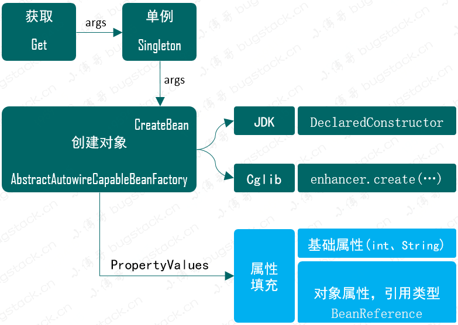
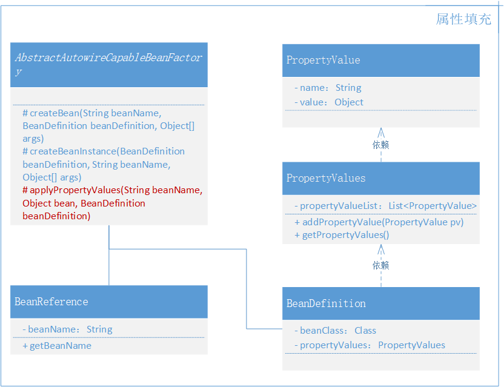

# 4. 为Bean对象注入属性和依赖Bean的功能实现

## 1. 目标

如果类有属性怎么办？依赖其他bean怎么办？

## 2. 设计



- 属性填充要在类实例化创建之后，也就是需要在 `AbstractAutowireCapableBeanFactory` 的 createBean 方法中添加 `applyPropertyValues` 操作。
- 由于我们需要在创建Bean时候填充属性操作，那么就需要在 bean 定义 BeanDefinition 类中，添加 PropertyValues 信息。
- 另外是填充属性信息还包括了 Bean 的对象类型，也就是需要再定义一个 BeanReference，里面其实就是一个简单的 Bean 名称，在具体的实例化操作时进行递归创建和填充，与 Spring 源码实现一样。*Spring 源码中 BeanReference 是一个接口*

## 3. 实现

### 1. Spring Bean 容器类关系



- 本章节中需要新增加3个类，`BeanReference`(类引用)、`PropertyValue`(属性值)、`PropertyValues`(属性集合)，分别用于类和其他类型属性填充操作。
- 另外改动的类主要是 `AbstractAutowireCapableBeanFactory`，在 createBean 中补全属性填充部分。

### 2. 定义属性

```
public class PropertyValue {

    private final String name;

    private final Object value;

    public PropertyValue(String name, Object value) {
        this.name = name;
        this.value = value;
    }
    
    // ...get/set
}
```

```
public class PropertyValues {

    private final List<PropertyValue> propertyValueList = new ArrayList<>();

    public void addPropertyValue(PropertyValue pv) {
        this.propertyValueList.add(pv);
    }

    public PropertyValue[] getPropertyValues() {
        return this.propertyValueList.toArray(new PropertyValue[0]);
    }

    public PropertyValue getPropertyValue(String propertyName) {
        for (PropertyValue pv : this.propertyValueList) {
            if (pv.getName().equals(propertyName)) {
                return pv;
            }
        }
        return null;
    }

}
```

- 这两个类的作用就是创建出一个用于传递类中属性信息的类，因为属性可能会有很多，所以还需要定义一个集合包装下。

### 3. Bean定义补全

```
public class BeanDefinition {

    private Class beanClass;

    private PropertyValues propertyValues;

    public BeanDefinition(Class beanClass) {
        this.beanClass = beanClass;
        this.propertyValues = new PropertyValues();
    }

    public BeanDefinition(Class beanClass, PropertyValues propertyValues) {
        this.beanClass = beanClass;
        this.propertyValues = propertyValues != null ? propertyValues : new PropertyValues();
    }
    
    // ...get/set
}
```

- 在 Bean 注册的过程中是需要传递 Bean 的信息，在几个前面章节的测试中都有所体现 `new BeanDefinition(UserService.class, propertyValues);`
- 所以为了把属性一定交给 Bean 定义，所以这里填充了 PropertyValues 属性，同时把两个构造函数做了一些简单的优化，避免后面 for 循环时还得判断属性填充是否为空。

### 4. Bean 属性填充

```
public abstract class AbstractAutowireCapableBeanFactory extends AbstractBeanFactory {

    private InstantiationStrategy instantiationStrategy = new CglibSubclassingInstantiationStrategy();

    @Override
    protected Object createBean(String beanName, BeanDefinition beanDefinition, Object[] args) throws BeansException {
        Object bean = null;
        try {
            bean = createBeanInstance(beanDefinition, beanName, args);
            // 给 Bean 填充属性
            applyPropertyValues(beanName, bean, beanDefinition);
        } catch (Exception e) {
            throw new BeansException("Instantiation of bean failed", e);
        }

        addSingleton(beanName, bean);
        return bean;
    }

    protected Object createBeanInstance(BeanDefinition beanDefinition, String beanName, Object[] args) {
        Constructor constructorToUse = null;
        Class<?> beanClass = beanDefinition.getBeanClass();
        Constructor<?>[] declaredConstructors = beanClass.getDeclaredConstructors();
        for (Constructor ctor : declaredConstructors) {
            if (null != args && ctor.getParameterTypes().length == args.length) {
                constructorToUse = ctor;
                break;
            }
        }
        return getInstantiationStrategy().instantiate(beanDefinition, beanName, constructorToUse, args);
    }

    /**
     * Bean 属性填充
     */
    protected void applyPropertyValues(String beanName, Object bean, BeanDefinition beanDefinition) {
        try {
            PropertyValues propertyValues = beanDefinition.getPropertyValues();
            for (PropertyValue propertyValue : propertyValues.getPropertyValues()) {

                String name = propertyValue.getName();
                Object value = propertyValue.getValue();

                if (value instanceof BeanReference) {
                    // A 依赖 B，获取 B 的实例化
                    BeanReference beanReference = (BeanReference) value;
                    value = getBean(beanReference.getBeanName());
                }
                // 属性填充
                BeanUtil.setFieldValue(bean, name, value);
            }
        } catch (Exception e) {
            throw new BeansException("Error setting property values：" + beanName);
        }
    }

    public InstantiationStrategy getInstantiationStrategy() {
        return instantiationStrategy;
    }

    public void setInstantiationStrategy(InstantiationStrategy instantiationStrategy) {
        this.instantiationStrategy = instantiationStrategy;
    }

}
```

- 这个类的内容稍微有点长，主要包括三个方法：createBean、createBeanInstance、applyPropertyValues，这里我们主要关注 createBean 的方法中调用的 applyPropertyValues 方法。
- 在 applyPropertyValues 中，通过获取 `beanDefinition.getPropertyValues()` 循环进行属性填充操作，如果遇到的是 BeanReference，那么就需要递归获取 Bean 实例，调用 getBean 方法。
- 当把依赖的 Bean 对象创建完成后，会递归回现在属性填充中。这里需要注意我们并没有去处理循环依赖的问题，这部分内容较大，后续补充。*BeanUtil.setFieldValue(bean, name, value) 是 hutool-all 工具类中的方法，你也可以自己实现*

## 4. 测试

### 1. 事先准备

```
public class UserDao {

    private static Map<String, String> hashMap = new HashMap<>();

    static {
        hashMap.put("10001", "张三");
        hashMap.put("10002", "李四");
        hashMap.put("10003", "王五");
    }

    public String queryUserName(String uId) {
        return hashMap.get(uId);
    }

}
```

**cn.bugstack.springframework.test.bean.UserService**

```java
public class UserService {

    private String id;

    private UserDao userDao;

    public void queryUserInfo() {
        System.out.println("查询用户信息：" + userDao.queryUserName(id));
    }

    public String getId() {
        return id;
    }

    public void setId(String uId) {
        this.id = uId;
    }

    public UserDao getUserDao() {
        return userDao;
    }

    public void setUserDao(UserDao userDao) {
        this.userDao = userDao;
    }
}
```

- Dao、Service，是我们平常开发经常使用的场景。在 UserService 中注入 UserDao，这样就能体现出Bean属性的依赖了。

### 2. 测试用例

```java
    @Test
    public void test(){
        // 1.初始化 BeanFactory
        DefaultListableBeanFactory beanFactory = new DefaultListableBeanFactory();

        // 2. UserDao 注册
        beanFactory.registerBeanDefinition("userDao", new BeanDefinition(UserDao.class));

        // 3. UserService 设置属性[uId、userDao]
        PropertyValues propertyValues = new PropertyValues();
        propertyValues.addPropertyValue(new PropertyValue("id", "10002"));
        propertyValues.addPropertyValue(new PropertyValue("userDao",new BeanReference("userDao")));

        // 4. UserService 注入bean
        BeanDefinition beanDefinition = new BeanDefinition(UserService.class, propertyValues);
        beanFactory.registerBeanDefinition("userService", beanDefinition);

        // 5. UserService 获取bean
        UserService userService = (UserService) beanFactory.getBean("userService");
        userService.queryUserInfo();

    }
```

- 与直接获取 Bean 对象不同，这次我们还需要先把 userDao 注入到 Bean 容器中。`beanFactory.registerBeanDefinition("userDao", new BeanDefinition(UserDao.class));`
- 接下来就是属性填充的操作了，一种是普通属性 `new PropertyValue("id", "10001")`，另外一种是对象属性 `new PropertyValue("userDao",new BeanReference("userDao"))`
- 接下来的操作就简单了，只不过是正常获取 userService 对象，调用方法即可。

### 3. 测试结果

```
查询用户信息：张三

Process finished with exit code 0
```

