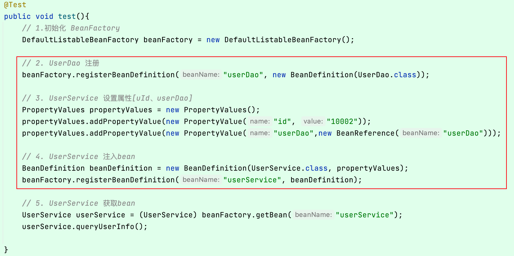
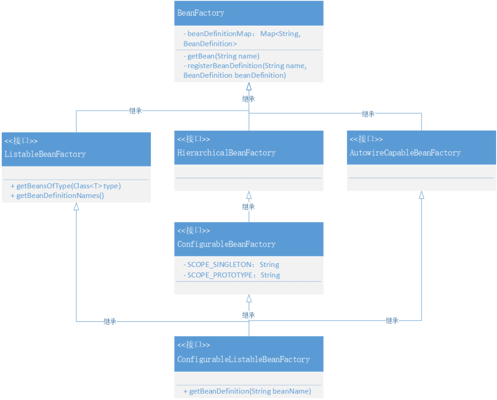

# 5. 设计与实现资源加载器，从Spring.xml解析和注册Bean对象

## 1. 目标



如何将2，3，4步骤使用配置文件注入？？

## 2. 设计


- 资源加载器属于相对独立的部分，它位于 Spring 框架核心包下的IO实现内容，主要用于处理Class、本地和云环境中的文件信息。
- 当资源可以加载后，接下来就是解析和注册 Bean 到 Spring 中的操作，这部分实现需要和 DefaultListableBeanFactory 核心类结合起来，因为你所有的解析后的注册动作，都会把 Bean 定义信息放入到这个类中。
- 那么在实现的时候就设计好接口的实现层级关系，包括我们需要定义出 Bean 定义的读取接口 `BeanDefinitionReader` 以及做好对应的实现类，在实现类中完成对 Bean 对象的解析和注册。

## 3. 实现

### 1. Spring Bean 容器资源加载和使用类关系


- 本章节为了能把 Bean 的定义、注册和初始化交给 Spring.xml 配置化处理，那么就需要实现两大块内容，分别是：资源加载器、xml资源处理类，实现过程主要以对接口 `Resource`、`ResourceLoader` 的实现，而另外 `BeanDefinitionReader` 接口则是对资源的具体使用，将配置信息注册到 Spring 容器中去。
- 在 Resource 的资源加载器的实现中包括了，ClassPath、系统文件、云配置文件，这三部分与 Spring 源码中的设计和实现保持一致，最终在 DefaultResourceLoader 中做具体的调用。
- 接口：BeanDefinitionReader、抽象类：AbstractBeanDefinitionReader、实现类：XmlBeanDefinitionReader，这三部分内容主要是合理清晰的处理了资源读取后的注册 Bean 容器操作。*接口管定义，抽象类处理非接口功能外的注册Bean组件填充，最终实现类即可只关心具体的业务实现*

图 6-4

- BeanFactory，已经存在的 Bean 工厂接口用于获取 Bean 对象，这次新增加了按照类型获取 Bean 的方法：`<T> T getBean(String name, Class<T> requiredType)`
- ListableBeanFactory，是一个扩展 Bean 工厂接口的接口，新增加了 `getBeansOfType`、`getBeanDefinitionNames()` 方法，在 Spring 源码中还有其他扩展方法。
- HierarchicalBeanFactory，在 Spring 源码中它提供了可以获取父类 BeanFactory 方法，属于是一种扩展工厂的层次子接口。*Sub-interface implemented by bean factories that can be part of a hierarchy.*
- AutowireCapableBeanFactory，是一个自动化处理Bean工厂配置的接口，目前案例工程中还没有做相应的实现，后续逐步完善。
- ConfigurableBeanFactory，可获取 BeanPostProcessor、BeanClassLoader等的一个配置化接口。
- ConfigurableListableBeanFactory，提供分析和修改Bean以及预先实例化的操作接口，不过目前只有一个 getBeanDefinition 方法。

### 2. 资源加载接口定义和实现

**cn.bugstack.springframework.core.io.Resource**

```
public interface Resource {

    InputStream getInputStream() throws IOException;

}
```

- 在 Spring 框架下创建 core.io 核心包，在这个包中主要用于处理资源加载流。
- 定义 Resource 接口，提供获取 InputStream 流的方法，接下来再分别实现三种不同的流文件操作：classPath、FileSystem、URL

**ClassPath**

```
public class ClassPathResource implements Resource {

    private final String path;

    private ClassLoader classLoader;

    public ClassPathResource(String path) {
        this(path, (ClassLoader) null);
    }

    public ClassPathResource(String path, ClassLoader classLoader) {
        Assert.notNull(path, "Path must not be null");
        this.path = path;
        this.classLoader = (classLoader != null ? classLoader : ClassUtils.getDefaultClassLoader());
    }

    @Override
    public InputStream getInputStream() throws IOException {
        InputStream is = classLoader.getResourceAsStream(path);
        if (is == null) {
            throw new FileNotFoundException(
                    this.path + " cannot be opened because it does not exist");
        }
        return is;
    }
}
```

- 这一部分的实现是用于通过 `ClassLoader` 读取`ClassPath` 下的文件信息，具体的读取过程主要是：`classLoader.getResourceAsStream(path)`

**FileSystem**

```
public class FileSystemResource implements Resource {

    private final File file;

    private final String path;

    public FileSystemResource(File file) {
        this.file = file;
        this.path = file.getPath();
    }

    public FileSystemResource(String path) {
        this.file = new File(path);
        this.path = path;
    }

    @Override
    public InputStream getInputStream() throws IOException {
        return new FileInputStream(this.file);
    }

    public final String getPath() {
        return this.path;
    }

}
```

- 通过指定文件路径的方式读取文件信息，这部分大家肯定还是非常熟悉的，经常会读取一些txt、excel文件输出到控制台。

**Url**

```
public class UrlResource implements Resource{

    private final URL url;

    public UrlResource(URL url) {
        Assert.notNull(url,"URL must not be null");
        this.url = url;
    }

    @Override
    public InputStream getInputStream() throws IOException {
        URLConnection con = this.url.openConnection();
        try {
            return con.getInputStream();
        }
        catch (IOException ex){
            if (con instanceof HttpURLConnection){
                ((HttpURLConnection) con).disconnect();
            }
            throw ex;
        }
    }

}
```

- 通过 HTTP 的方式读取云服务的文件，我们也可以把配置文件放到 GitHub 或者 Gitee 上。

### 3. 包装资源加载器

按照资源加载的不同方式，资源加载器可以把这些方式集中到统一的类服务下进行处理，外部用户只需要传递资源地址即可，简化使用。

**定义接口**

```
public interface ResourceLoader {

    /**
     * Pseudo URL prefix for loading from the class path: "classpath:"
     */
    String CLASSPATH_URL_PREFIX = "classpath:";

    Resource getResource(String location);

}
```

- 定义获取资源接口，里面传递 location 地址即可。

**实现接口**

```
public class DefaultResourceLoader implements ResourceLoader {

    @Override
    public Resource getResource(String location) {
        Assert.notNull(location, "Location must not be null");
        if (location.startsWith(CLASSPATH_URL_PREFIX)) {
            return new ClassPathResource(location.substring(CLASSPATH_URL_PREFIX.length()));
        }
        else {
            try {
                URL url = new URL(location);
                return new UrlResource(url);
            } catch (MalformedURLException e) {
                return new FileSystemResource(location);
            }
        }
    }

}
```

- 在获取资源的实现中，主要是把三种不同类型的资源处理方式进行了包装，分为：判断是否为ClassPath、URL以及文件。
- 虽然 DefaultResourceLoader 类实现的过程简单，但这也是设计模式约定的具体结果，像是这里不会让外部调用放知道过多的细节，而是仅关心具体调用结果即可。

### 4. Bean定义读取接口

```
public interface BeanDefinitionReader {

    BeanDefinitionRegistry getRegistry();

    ResourceLoader getResourceLoader();

    void loadBeanDefinitions(Resource resource) throws BeansException;

    void loadBeanDefinitions(Resource... resources) throws BeansException;

    void loadBeanDefinitions(String location) throws BeansException;

}
```

- 这是一个 *Simple interface for bean definition readers.* 其实里面无非定义了几个方法，包括：getRegistry()、getResourceLoader()，以及三个加载Bean定义的方法。
- 这里需要注意 getRegistry()、getResourceLoader()，都是用于提供给后面三个方法的工具，加载和注册，这两个方法的实现会包装到抽象类中，以免污染具体的接口实现方法。

### 5. Bean定义抽象类实现

```
public abstract class AbstractBeanDefinitionReader implements BeanDefinitionReader {

    private final BeanDefinitionRegistry registry;

    private ResourceLoader resourceLoader;

    protected AbstractBeanDefinitionReader(BeanDefinitionRegistry registry) {
        this(registry, new DefaultResourceLoader());
    }

    public AbstractBeanDefinitionReader(BeanDefinitionRegistry registry, ResourceLoader resourceLoader) {
        this.registry = registry;
        this.resourceLoader = resourceLoader;
    }

    @Override
    public BeanDefinitionRegistry getRegistry() {
        return registry;
    }

    @Override
    public ResourceLoader getResourceLoader() {
        return resourceLoader;
    }

}
```

- 抽象类把 BeanDefinitionReader 接口的前两个方法全部实现完了，并提供了构造函数，让外部的调用使用方，把Bean定义注入类，传递进来。
- 这样在接口 BeanDefinitionReader 的具体实现类中，就可以把解析后的 XML 文件中的 Bean 信息，注册到 Spring 容器去了。*以前我们是通过单元测试使用，调用 BeanDefinitionRegistry 完成Bean的注册，现在可以放到 XMl 中操作了*

### 6. 解析XML处理Bean注册

```
public class XmlBeanDefinitionReader extends AbstractBeanDefinitionReader {

    public XmlBeanDefinitionReader(BeanDefinitionRegistry registry) {
        super(registry);
    }

    public XmlBeanDefinitionReader(BeanDefinitionRegistry registry, ResourceLoader resourceLoader) {
        super(registry, resourceLoader);
    }

    @Override
    public void loadBeanDefinitions(Resource resource) throws BeansException {
        try {
            try (InputStream inputStream = resource.getInputStream()) {
                doLoadBeanDefinitions(inputStream);
            }
        } catch (IOException | ClassNotFoundException e) {
            throw new BeansException("IOException parsing XML document from " + resource, e);
        }
    }

    @Override
    public void loadBeanDefinitions(Resource... resources) throws BeansException {
        for (Resource resource : resources) {
            loadBeanDefinitions(resource);
        }
    }

    @Override
    public void loadBeanDefinitions(String location) throws BeansException {
        ResourceLoader resourceLoader = getResourceLoader();
        Resource resource = resourceLoader.getResource(location);
        loadBeanDefinitions(resource);
    }

    protected void doLoadBeanDefinitions(InputStream inputStream) throws ClassNotFoundException {
        Document doc = XmlUtil.readXML(inputStream);
        Element root = doc.getDocumentElement();
        NodeList childNodes = root.getChildNodes();

        for (int i = 0; i < childNodes.getLength(); i++) {
            // 判断元素
            if (!(childNodes.item(i) instanceof Element)) continue;
            // 判断对象
            if (!"bean".equals(childNodes.item(i).getNodeName())) continue;
            
            // 解析标签
            Element bean = (Element) childNodes.item(i);
            String id = bean.getAttribute("id");
            String name = bean.getAttribute("name");
            String className = bean.getAttribute("class");
            // 获取 Class，方便获取类中的名称
            Class<?> clazz = Class.forName(className);
            // 优先级 id > name
            String beanName = StrUtil.isNotEmpty(id) ? id : name;
            if (StrUtil.isEmpty(beanName)) {
                beanName = StrUtil.lowerFirst(clazz.getSimpleName());
            }

            // 定义Bean
            BeanDefinition beanDefinition = new BeanDefinition(clazz);
            // 读取属性并填充
            for (int j = 0; j < bean.getChildNodes().getLength(); j++) {
                if (!(bean.getChildNodes().item(j) instanceof Element)) continue;
                if (!"property".equals(bean.getChildNodes().item(j).getNodeName())) continue;
                // 解析标签：property
                Element property = (Element) bean.getChildNodes().item(j);
                String attrName = property.getAttribute("name");
                String attrValue = property.getAttribute("value");
                String attrRef = property.getAttribute("ref");
                // 获取属性值：引入对象、值对象
                Object value = StrUtil.isNotEmpty(attrRef) ? new BeanReference(attrRef) : attrValue;
                // 创建属性信息
                PropertyValue propertyValue = new PropertyValue(attrName, value);
                beanDefinition.getPropertyValues().addPropertyValue(propertyValue);
            }
            if (getRegistry().containsBeanDefinition(beanName)) {
                throw new BeansException("Duplicate beanName[" + beanName + "] is not allowed");
            }
            // 注册 BeanDefinition
            getRegistry().registerBeanDefinition(beanName, beanDefinition);
        }
    }

}
```

XmlBeanDefinitionReader 类最核心的内容就是对 XML 文件的解析，把我们本来在代码中的操作放到了通过解析 XML 自动注册的方式。

- loadBeanDefinitions 方法，处理资源加载，这里新增加了一个内部方法：`doLoadBeanDefinitions`，它主要负责解析 xml
- 在 doLoadBeanDefinitions 方法中，主要是对xml的读取 `XmlUtil.readXML(inputStream)` 和元素 Element 解析。在解析的过程中通过循环操作，以此获取 Bean 配置以及配置中的 id、name、class、value、ref 信息。
- 最终把读取出来的配置信息，创建成 BeanDefinition 以及 PropertyValue，最终把完整的 Bean 定义内容注册到 Bean 容器：`getRegistry().registerBeanDefinition(beanName, beanDefinition)`

## 4. 测试

### 1. 事先准备

```

public class UserDao {

    private static Map<String, String> hashMap = new HashMap<>();

    static {
        hashMap.put("10001", "张三");
        hashMap.put("10002", "李四");
        hashMap.put("10003", "王五");
    }

    public String queryUserName(String uId) {
        return hashMap.get(uId);
    }

}

```

```
public class UserService {

    private String id;

    private UserDao userDao;

    public void queryUserInfo() {
        System.out.println("查询用户信息：" + userDao.queryUserName(id));
    }

    public String getId() {
        return id;
    }

    public void setId(String id) {
        this.id = id;
    }

    public UserDao getUserDao() {
        return userDao;
    }

    public void setUserDao(UserDao userDao) {
        this.userDao = userDao;
    }
}
```

- Dao、Service，是我们平常开发经常使用的场景。在 UserService 中注入 UserDao，这样就能体现出Bean属性的依赖了。

### 2. 配置文件

**important.properties**

```
# Config File
system.key=OLpj9823dZ
```

**spring.xml**

```
<?xml version="1.0" encoding="UTF-8"?>
<beans>

    <bean id="userDao" class="cn.bugstack.springframework.test.bean.UserDao"/>

    <bean id="userService" class="cn.bugstack.springframework.test.bean.UserService">
        <property name="uId" value="10001"/>
        <property name="userDao" ref="userDao"/>
    </bean>

</beans>
```

- 这里有两份配置文件，一份用于测试资源加载器，另外 spring.xml 用于测试整体的 Bean 注册功能。

### 3. 单元测试(资源加载)

**案例**

```
package org.example;

import cn.hutool.core.io.IoUtil;
import org.example.spring.PropertyValue;
import org.example.spring.PropertyValues;
import org.example.spring.core.io.DefaultResourceLoader;
import org.example.spring.core.io.Resource;
import org.example.spring.factory.config.BeanDefinition;
import org.example.spring.factory.config.BeanReference;
import org.example.spring.factory.support.DefaultListableBeanFactory;
import org.example.spring.factory.xml.XmlBeanDefinitionReader;
import org.junit.Before;
import org.junit.Test;

import java.io.IOException;
import java.io.InputStream;

/**
 * <p>Description: </p>
 *
 * @author jinjie
 * <p>Date: 2023/6/14</p>
 **/

public class ApiTest {
    private DefaultResourceLoader resourceLoader;

    @Before
    public void init() {
        resourceLoader = new DefaultResourceLoader();
    }

    @Test
    public void testClasspath() throws IOException {
        Resource resource = resourceLoader.getResource("classpath:important.properties");
        InputStream inputStream = resource.getInputStream();
        String content = IoUtil.readUtf8(inputStream);
        System.out.println(content);
    }

    @Test
    public void testFile() throws IOException {
        Resource resource = resourceLoader.getResource("src/test/resources/important.properties");
        InputStream inputStream = resource.getInputStream();
        String content = IoUtil.readUtf8(inputStream);
        System.out.println(content);
    }
   
}

```

**测试结果**

```
# Config File
system.key=OLpj9823dZ

Process finished with exit code 0
```

- 这三个方法：test_classpath、test_file、test_url，分别用于测试加载 ClassPath、FileSystem、Url 文件，*URL文件在Github，可能加载时会慢*

### 4. 单元测试(配置文件注册Bean)

**案例**

```
@Test
public void test_xml() {
    // 1.初始化 BeanFactory
    DefaultListableBeanFactory beanFactory = new DefaultListableBeanFactory();

    // 2. 读取配置文件&注册Bean
    XmlBeanDefinitionReader reader = new XmlBeanDefinitionReader(beanFactory);
    reader.loadBeanDefinitions("classpath:spring.xml");

    // 3. 获取Bean对象调用方法
    UserService userService = beanFactory.getBean("userService", UserService.class);
    String result = userService.queryUserInfo();
    System.out.println("测试结果：" + result);
}
```

**测试结果**

```
测试结果：张三

Process finished with exit code 0
```

- 在上面的测试案例中可以看到，我们把以前通过手动注册 Bean 以及配置属性信息的内容，交给了 `new XmlBeanDefinitionReader(beanFactory)` 类读取 Spring.xml 的方式来处理，并通过了测试验证。