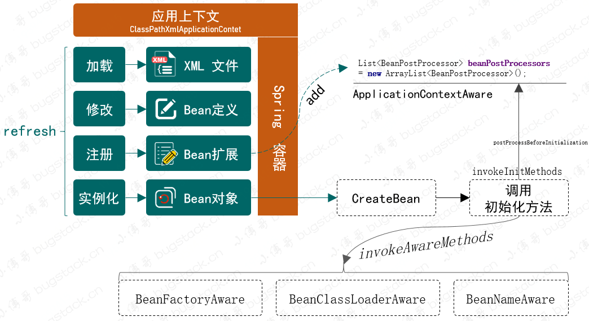
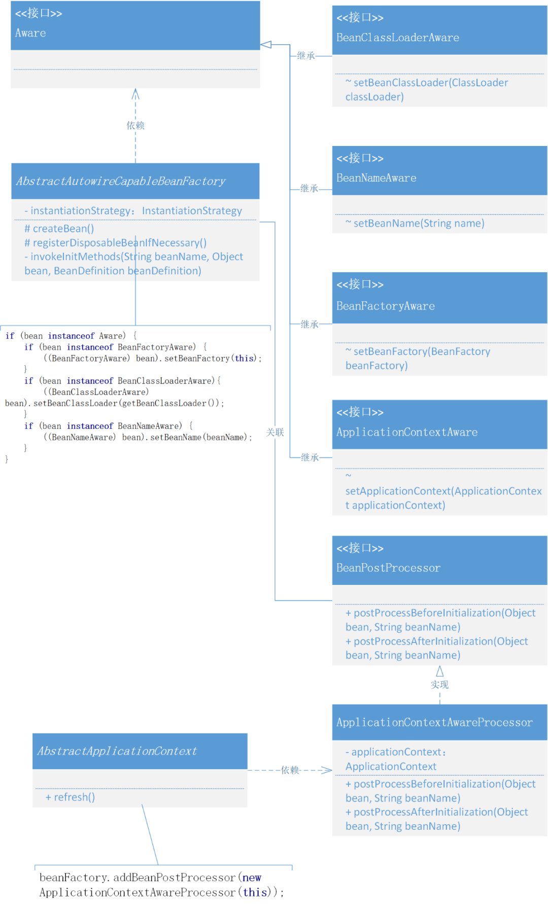

# 8. 定义标记类型Aware接口，实现感知容器对象

## 1. 目标

提供一种能感知容器操作的接口，如果谁实现了这样的一个接口，就可以获取接口入参中的各类能力。

## 2. 设计



- 定义接口 Aware，在 Spring 框架中它是一种感知标记性接口，具体的子类定义和实现能感知容器中的相关对象。*也就是通过这个桥梁，向具体的实现类中提供容器服务*
- 继承 Aware 的接口包括：BeanFactoryAware、BeanClassLoaderAware、BeanNameAware和ApplicationContextAware，当然在 Spring 源码中还有一些其他关于注解的，不过目前我们还是用不到。
- 在具体的接口实现过程中你可以看到，一部分(*BeanFactoryAware、BeanClassLoaderAware、BeanNameAware*)在 factory 的 support 文件夹下，另外 ApplicationContextAware 是在 context 的 support 中，这是因为不同的内容获取需要在不同的包下提供。所以，在 AbstractApplicationContext 的具体实现中会用到向 beanFactory 添加 BeanPostProcessor 内容的 `ApplicationContextAwareProcessor` 操作，最后由 AbstractAutowireCapableBeanFactory 创建 createBean 时处理相应的调用操作。*关于 applyBeanPostProcessorsBeforeInitialization 已经在前面章节中实现过，如果忘记可以往前翻翻*

## 3. 实现

### 1. Spring 感知接口的设计和实现类关系



- 以上整个类关系就是关于 Aware 感知的定义和对容器感知的实现。
- Aware 有四个继承的接口，其他这些接口的继承都是为了继承一个标记，有了标记的存在更方便类的操作和具体判断实现。
- 另外由于 ApplicationContext 并不是在 AbstractAutowireCapableBeanFactory 中 createBean 方法下的内容，所以需要像容器中注册 `addBeanPostProcessor` ，再由  createBean  统一调用 applyBeanPostProcessorsBeforeInitialization 时进行操作。

### 2. 定义标记接口

```
/**
 * Marker superinterface indicating that a bean is eligible to be
 * notified by the Spring container of a particular framework object
 * through a callback-style method.  Actual method signature is
 * determined by individual subinterfaces, but should typically
 * consist of just one void-returning method that accepts a single
 * argument.
 *
 * 标记类接口，实现该接口可以被Spring容器感知
 *
 */
public interface Aware {
}
```

- 在 Spring 中有特别多类似这样的标记接口的设计方式，它们的存在就像是一种标签一样，可以方便统一摘取出属于此类接口的实现类，通常会有 instanceof 一起判断使用。

### 3. 容器感知类

#### 3.1 BeanFactoryAware

```
public interface BeanFactoryAware extends Aware {

   void setBeanFactory(BeanFactory beanFactory) throws BeansException;

}
```

- Interface to be implemented by beans that wish to be aware of their owning {@link BeanFactory}.
- 实现此接口，既能感知到所属的 BeanFactory

#### 3.2 BeanClassLoaderAware

```
public interface BeanClassLoaderAware extends Aware{

    void setBeanClassLoader(ClassLoader classLoader);

}
```

- Callback that allows a bean to be aware of the bean{@link ClassLoader class loader}; that is, the class loader used by the present bean factory to load bean classes.
- 实现此接口，既能感知到所属的 ClassLoader

#### 3.3 BeanNameAware

```
public interface BeanNameAware extends Aware {

    void setBeanName(String name);

}
```

- Interface to be implemented by beans that want to be aware of their bean name in a bean factory.
- 实现此接口，既能感知到所属的 BeanName

#### 3.4 ApplicationContextAware

```
public interface ApplicationContextAware extends Aware {

    void setApplicationContext(ApplicationContext applicationContext) throws BeansException;

}
```

- Interface to be implemented by any object that wishes to be notifiedof the {@link ApplicationContext} that it runs in.
- 实现此接口，既能感知到所属的 ApplicationContext

### 4. 包装处理器(ApplicationContextAwareProcessor)

```
public class ApplicationContextAwareProcessor implements BeanPostProcessor {

    private final ApplicationContext applicationContext;

    public ApplicationContextAwareProcessor(ApplicationContext applicationContext) {
        this.applicationContext = applicationContext;
    }

    @Override
    public Object postProcessBeforeInitialization(Object bean, String beanName) throws BeansException {
        if (bean instanceof ApplicationContextAware){
            ((ApplicationContextAware) bean).setApplicationContext(applicationContext);
        }
        return bean;
    }

    @Override
    public Object postProcessAfterInitialization(Object bean, String beanName) throws BeansException {
        return bean;
    }

}
```

- 由于 ApplicationContext 的获取并不能直接在创建 Bean 时候就可以拿到，所以需要在 refresh 操作时，把 ApplicationContext 写入到一个包装的 BeanPostProcessor 中去，再由 AbstractAutowireCapableBeanFactory.applyBeanPostProcessorsBeforeInitialization 方法调用。

### 5. 注册 BeanPostProcessor

```
public abstract class AbstractApplicationContext extends DefaultResourceLoader implements ConfigurableApplicationContext {

    @Override
    public void refresh() throws BeansException {
        // 1. 创建 BeanFactory，并加载 BeanDefinition
        refreshBeanFactory();

        // 2. 获取 BeanFactory
        ConfigurableListableBeanFactory beanFactory = getBeanFactory();

        // 3. 添加 ApplicationContextAwareProcessor，让继承自 ApplicationContextAware 的 Bean 对象都能感知所属的 ApplicationContext
        beanFactory.addBeanPostProcessor(new ApplicationContextAwareProcessor(this));

        // 4. 在 Bean 实例化之前，执行 BeanFactoryPostProcessor (Invoke factory processors registered as beans in the context.)
        invokeBeanFactoryPostProcessors(beanFactory);

        // 5. BeanPostProcessor 需要提前于其他 Bean 对象实例化之前执行注册操作
        registerBeanPostProcessors(beanFactory);

        // 6. 提前实例化单例Bean对象
        beanFactory.preInstantiateSingletons();
    }
    
  // ...   
}    
```

- refresh() 方法就是整个 Spring 容器的操作过程，与上一章节对比，本次新增加了关于 addBeanPostProcessor 的操作。
- 添加 ApplicationContextAwareProcessor，让继承自 ApplicationContextAware 的 Bean 对象都能感知所属的 ApplicationContext。

### 6. 感知调用操作

```
public abstract class AbstractAutowireCapableBeanFactory extends AbstractBeanFactory implements AutowireCapableBeanFactory {

    private InstantiationStrategy instantiationStrategy = new CglibSubclassingInstantiationStrategy();

    @Override
    protected Object createBean(String beanName, BeanDefinition beanDefinition, Object[] args) throws BeansException {
        Object bean = null;
        try {
            bean = createBeanInstance(beanDefinition, beanName, args);
            // 给 Bean 填充属性
            applyPropertyValues(beanName, bean, beanDefinition);
            // 执行 Bean 的初始化方法和 BeanPostProcessor 的前置和后置处理方法
            bean = initializeBean(beanName, bean, beanDefinition);
        } catch (Exception e) {
            throw new BeansException("Instantiation of bean failed", e);
        }

        // 注册实现了 DisposableBean 接口的 Bean 对象
        registerDisposableBeanIfNecessary(beanName, bean, beanDefinition);

        addSingleton(beanName, bean);
        return bean;
    }

    private Object initializeBean(String beanName, Object bean, BeanDefinition beanDefinition) {

        // invokeAwareMethods
        if (bean instanceof Aware) {
            if (bean instanceof BeanFactoryAware) {
                ((BeanFactoryAware) bean).setBeanFactory(this);
            }
            if (bean instanceof BeanClassLoaderAware){
                ((BeanClassLoaderAware) bean).setBeanClassLoader(getBeanClassLoader());
            }
            if (bean instanceof BeanNameAware) {
                ((BeanNameAware) bean).setBeanName(beanName);
            }
        }

        // 1. 执行 BeanPostProcessor Before 处理
        Object wrappedBean = applyBeanPostProcessorsBeforeInitialization(bean, beanName);

        // 执行 Bean 对象的初始化方法
        try {
            invokeInitMethods(beanName, wrappedBean, beanDefinition);
        } catch (Exception e) {
            throw new BeansException("Invocation of init method of bean[" + beanName + "] failed", e);
        }

        // 2. 执行 BeanPostProcessor After 处理
        wrappedBean = applyBeanPostProcessorsAfterInitialization(bean, beanName);
        return wrappedBean;
    }


    @Override
    public Object applyBeanPostProcessorsBeforeInitialization(Object existingBean, String beanName) throws BeansException {
        Object result = existingBean;
        for (BeanPostProcessor processor : getBeanPostProcessors()) {
            Object current = processor.postProcessBeforeInitialization(result, beanName);
            if (null == current) return result;
            result = current;
        }
        return result;
    }

    @Override
    public Object applyBeanPostProcessorsAfterInitialization(Object existingBean, String beanName) throws BeansException {
        Object result = existingBean;
        for (BeanPostProcessor processor : getBeanPostProcessors()) {
            Object current = processor.postProcessAfterInitialization(result, beanName);
            if (null == current) return result;
            result = current;
        }
        return result;
    }

}
```

- 这里我们去掉了一些类的内容，只保留关于本次 Aware 感知接口的操作。
- 首先在 initializeBean 中，通过判断 `bean instanceof Aware`，调用了三个接口方法，`BeanFactoryAware.setBeanFactory(this)`、`BeanClassLoaderAware.setBeanClassLoader(getBeanClassLoader())`、`BeanNameAware.setBeanName(beanName)`，这样就能通知到已经实现了此接口的类。
- 另外我们还向 BeanPostProcessor 中添加了 `ApplicationContextAwareProcessor`，此时在这个方法中也会被调用到具体的类实现，得到一个 ApplicationContex 属性。

## 4. 测试

### 1. 事先准备

```
public class UserDao {

    private static Map<String, String> hashMap = new HashMap<>();

    public void initDataMethod(){
        System.out.println("执行：init-method");
        hashMap.put("10001", "张三");
        hashMap.put("10002", "李四");
        hashMap.put("10003", "王五");
    }

    public void destroyDataMethod(){
        System.out.println("执行：destroy-method");
        hashMap.clear();
    }

    public String queryUserName(String id) {
        return hashMap.get(id);
    }

}

```

```
public class UserService implements BeanNameAware, BeanClassLoaderAware, ApplicationContextAware, BeanFactoryAware {

   
    private String id;
    private String company;
    private String location;
    private UserDao userDao;

    private ApplicationContext applicationContext;
    private BeanFactory beanFactory;

    @Override
    public void setBeanFactory(BeanFactory beanFactory) throws BeansException {
        this.beanFactory = beanFactory;
    }

    @Override
    public void setApplicationContext(ApplicationContext applicationContext) throws BeansException {
        this.applicationContext = applicationContext;
    }

    @Override
    public void setBeanName(String name) {
        System.out.println("Bean Name is：" + name);
    }

    @Override
    public void setBeanClassLoader(ClassLoader classLoader) {
        System.out.println("ClassLoader：" + classLoader);
    }

    public String queryUserInfo() {
        return userDao.queryUserName(id) + "," + company + "," + location;
    }
}
```

- UserDao 本次并没有什么改变，还是提供了关于初始化的方法，并在 Spring.xml 中提供 init-method、destroy-method 配置信息。
- UserService 新增加，BeanNameAware, BeanClassLoaderAware, ApplicationContextAware, BeanFactoryAware，四个感知的实现类，并在类中实现相应的接口方法。

### 2. 配置文件

**基础配置，无BeanFactoryPostProcessor、BeanPostProcessor，实现类**

```
<?xml version="1.0" encoding="UTF-8"?>
<beans>

    <bean id="userDao" class="org.example.UserDao" init-method="initDataMethod" destroy-method="destroyDataMethod"/>

    <bean id="userService" class="org.example.UserService">
        <property name="id" value="10001"/>
        <property name="company" value="腾讯"/>
        <property name="location" value="深圳"/>
        <property name="userDao" ref="userDao"/>
    </bean>

</beans>
```

- 本章节中并没有额外新增加配置信息，与上一章节内容相同。

### 3. 单元测试

```
@Test
public void test_xml() {
// 1.初始化 BeanFactory
        ClassPathXmlApplicationContext applicationContext = new ClassPathXmlApplicationContext("classpath:spring.xml");
        applicationContext.registerShutdownHook();

        // 2. 获取Bean对象调用方法
        UserService userService = applicationContext.getBean("userService", UserService.class);
        String result = userService.queryUserInfo();
        System.out.println("测试结果：" + result);

        System.out.println("ApplicationContextAware："+userService.getApplicationContext());
        System.out.println("BeanFactoryAware："+userService.getBeanFactory());
}
```

- 测试方法中主要是添加了一写关于新增 Aware 实现的调用，其他不需要调用的也打印了相应的日志信息，可以在测试结果中看到。

**测试结果**

```
执行：init-method
ClassLoader：sun.misc.Launcher$AppClassLoader@18b4aac2
Bean Name is：userService
测试结果：张三,腾讯,深圳
ApplicationContextAware：org.example.spring.context.support.ClassPathXmlApplicationContext@3ac3fd8b
BeanFactoryAware：org.example.spring.beans.factory.support.DefaultListableBeanFactory@5594a1b5
执行：destroy-method


Process finished with exit code 0
```

- 从测试结果可以看到，本章节新增加的感知接口对应的具体实现(BeanNameAware, BeanClassLoaderAware, ApplicationContextAware, BeanFactoryAware)，已经可以如期输出结果了。