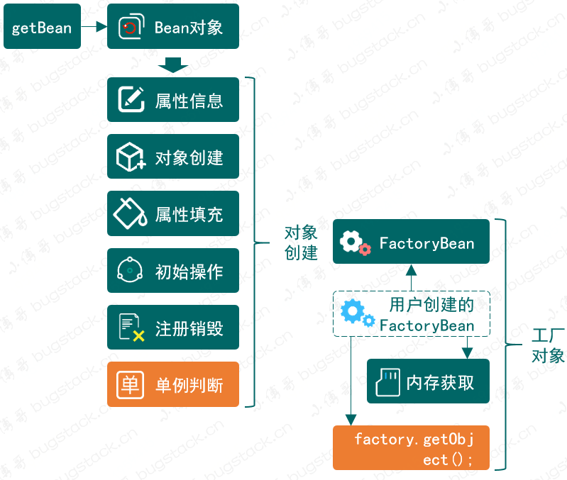
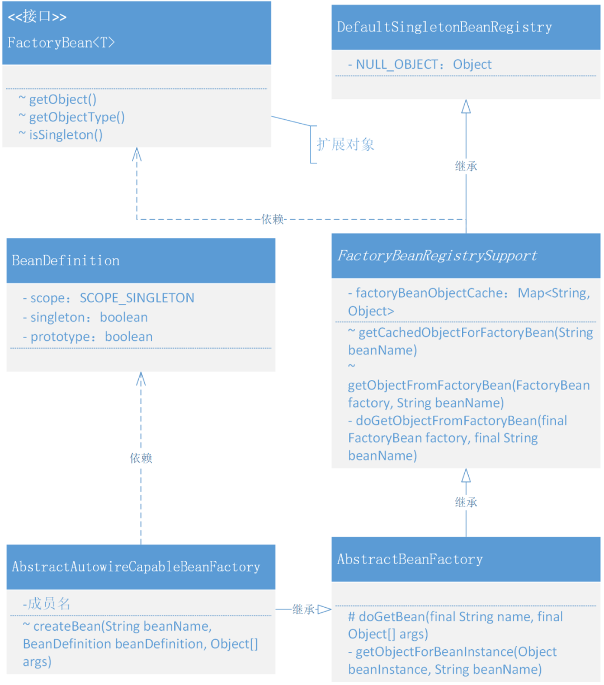

# 9. 关于Bean对象作用域以及FactoryBean的实现和使用

## 1. 目标

- Bean 就永远是单例的吗，没有可能是原型模式吗？

- 在集合 Spring 框架下，我们使用的 MyBatis 框架中，它的核心作用是可以满足用户不需要实现 Dao 接口类，就可以通过 xml 或者注解配置的方式完成对数据库执行 CRUD 操作，那么在实现这样的 ORM 框架中，是怎么把一个数据库操作的 Bean 对象交给 Spring 管理的呢？

## 2. 设计



- 整个的实现过程包括了两部分，一个解决单例还是原型对象，另外一个处理 FactoryBean 类型对象创建过程中关于获取具体调用对象的 `getObject` 操作。
- `SCOPE_SINGLETON`、`SCOPE_PROTOTYPE`，对象类型的创建获取方式，主要区分在于 `AbstractAutowireCapableBeanFactory#createBean` 创建完成对象后是否放入到内存中，如果不放入则每次获取都会重新创建。
- createBean 执行对象创建、属性填充、依赖加载、前置后置处理、初始化等操作后，就要开始做执行判断整个对象是否是一个 FactoryBean 对象，如果是这样的对象，就需要再继续执行获取 FactoryBean  具体对象中的 `getObject` 对象了。整个 getBean 过程中都会新增一个单例类型的判断`factory.isSingleton()`，用于决定是否使用内存存放对象信息。

## 3. 实现

### 1. Spring 单例、原型以及 `FactoryBean` 功能实现类关系



- 以上整个类关系图展示的就是添加 Bean 的实例化是单例还是原型模式以及 FactoryBean 的实现。
- 其实整个实现的过程并不复杂，只是在现有的 AbstractAutowireCapableBeanFactory 类以及继承的抽象类 AbstractBeanFactory 中进行扩展。
- 不过这次我们把 AbstractBeanFactory 继承的 DefaultSingletonBeanRegistry 类，中间加了一层 FactoryBeanRegistrySupport，这个类在 Spring 框架中主要是处理关于 FactoryBean 注册的支撑操作。
- *MyBatis 就是实现了一个 MapperFactoryBean 类，在 getObject 方法中提供 SqlSession 对执行 CRUD 方法的操作* 

### 2. Bean的作用范围定义和xml解析

```
public class BeanDefinition {

    String SCOPE_SINGLETON = ConfigurableBeanFactory.SCOPE_SINGLETON;

    String SCOPE_PROTOTYPE = ConfigurableBeanFactory.SCOPE_PROTOTYPE;

    private Class beanClass;

    private PropertyValues propertyValues;

    private String initMethodName;

    private String destroyMethodName;

    private String scope = SCOPE_SINGLETON;

    private boolean singleton = true;

    private boolean prototype = false;
    
    // ...get/set
}
```

- singleton、prototype，是本次在 BeanDefinition 类中新增加的两个属性信息，用于把从 spring.xml 中解析到的 Bean 对象作用范围填充到属性中。

```
public class XmlBeanDefinitionReader extends AbstractBeanDefinitionReader {

    protected void doLoadBeanDefinitions(InputStream inputStream) throws ClassNotFoundException {
      
        for (int i = 0; i < childNodes.getLength(); i++) {
            // 判断元素
            if (!(childNodes.item(i) instanceof Element)) continue;
            // 判断对象
            if (!"bean".equals(childNodes.item(i).getNodeName())) continue;

            // 解析标签
            Element bean = (Element) childNodes.item(i);
            String id = bean.getAttribute("id");
            String name = bean.getAttribute("name");
            String className = bean.getAttribute("class");
            String initMethod = bean.getAttribute("init-method");
            String destroyMethodName = bean.getAttribute("destroy-method");
            String beanScope = bean.getAttribute("scope");

            // 获取 Class，方便获取类中的名称
            Class<?> clazz = Class.forName(className);
            // 优先级 id > name
            String beanName = StrUtil.isNotEmpty(id) ? id : name;
            if (StrUtil.isEmpty(beanName)) {
                beanName = StrUtil.lowerFirst(clazz.getSimpleName());
            }

            // 定义Bean
            BeanDefinition beanDefinition = new BeanDefinition(clazz);
            beanDefinition.setInitMethodName(initMethod);
            beanDefinition.setDestroyMethodName(destroyMethodName);

            if (StrUtil.isNotEmpty(beanScope)) {
                beanDefinition.setScope(beanScope);
            }
            
            // ...
            
            // 注册 BeanDefinition
            getRegistry().registerBeanDefinition(beanName, beanDefinition);
        }
    }

}
```

- 在解析 XML 处理类 XmlBeanDefinitionReader 中，新增加了关于 Bean 对象配置中 scope 的解析，并把这个属性信息填充到 Bean 定义中。`beanDefinition.setScope(beanScope)`

### 3. 创建和修改对象时候判断单例和原型模式

```
public abstract class AbstractAutowireCapableBeanFactory extends AbstractBeanFactory implements AutowireCapableBeanFactory {

    private InstantiationStrategy instantiationStrategy = new CglibSubclassingInstantiationStrategy();

    @Override
    protected Object createBean(String beanName, BeanDefinition beanDefinition, Object[] args) throws BeansException {
        Object bean = null;
        try {
            bean = createBeanInstance(beanDefinition, beanName, args);
            // 给 Bean 填充属性
            applyPropertyValues(beanName, bean, beanDefinition);
            // 执行 Bean 的初始化方法和 BeanPostProcessor 的前置和后置处理方法
            bean = initializeBean(beanName, bean, beanDefinition);
        } catch (Exception e) {
            throw new BeansException("Instantiation of bean failed", e);
        }

        // 注册实现了 DisposableBean 接口的 Bean 对象
        registerDisposableBeanIfNecessary(beanName, bean, beanDefinition);

        // 判断 SCOPE_SINGLETON、SCOPE_PROTOTYPE
        if (beanDefinition.isSingleton()) {
            addSingleton(beanName, bean);
        }
        return bean;
    }

    protected void registerDisposableBeanIfNecessary(String beanName, Object bean, BeanDefinition beanDefinition) {
        // 非 Singleton 类型的 Bean 不执行销毁方法
        if (!beanDefinition.isSingleton()) return;

        if (bean instanceof DisposableBean || StrUtil.isNotEmpty(beanDefinition.getDestroyMethodName())) {
            registerDisposableBean(beanName, new DisposableBeanAdapter(bean, beanName, beanDefinition));
        }
    }
    
    // ... 其他功能
}
```

- 单例模式和原型模式的区别就在于是否存放到内存中，如果是原型模式那么就不会存放到内存中，每次获取都重新创建对象，另外非 Singleton 类型的 Bean 不需要执行销毁方法。
- 所以这里的代码会有两处修改，一处是 createBean 中判断是否添加到 addSingleton(beanName, bean);，另外一处是 registerDisposableBeanIfNecessary 销毁注册中的判断 `if (!beanDefinition.isSingleton()) return;`。

### 4. 定义 FactoryBean 接口

```
public interface FactoryBean<T> {

    T getObject() throws Exception;

    Class<?> getObjectType();

    boolean isSingleton();

}
```

- FactoryBean 中需要提供3个方法，获取对象、对象类型，以及是否是单例对象，如果是单例对象依然会被放到内存中。

### 5. 实现一个 FactoryBean 注册服务

```
public abstract class FactoryBeanRegistrySupport extends DefaultSingletonBeanRegistry {

    /**
     * Cache of singleton objects created by FactoryBeans: FactoryBean name --> object
     */
    private final Map<String, Object> factoryBeanObjectCache = new ConcurrentHashMap<String, Object>();

    protected Object getCachedObjectForFactoryBean(String beanName) {
        Object object = this.factoryBeanObjectCache.get(beanName);
        return (object != NULL_OBJECT ? object : null);
    }

    protected Object getObjectFromFactoryBean(FactoryBean factory, String beanName) {
        if (factory.isSingleton()) {
            Object object = this.factoryBeanObjectCache.get(beanName);
            if (object == null) {
                object = doGetObjectFromFactoryBean(factory, beanName);
                this.factoryBeanObjectCache.put(beanName, (object != null ? object : NULL_OBJECT));
            }
            return (object != NULL_OBJECT ? object : null);
        } else {
            return doGetObjectFromFactoryBean(factory, beanName);
        }
    }

    private Object doGetObjectFromFactoryBean(final FactoryBean factory, final String beanName){
        try {
            return factory.getObject();
        } catch (Exception e) {
            throw new BeansException("FactoryBean threw exception on object[" + beanName + "] creation", e);
        }
    }

}
```

- FactoryBeanRegistrySupport 类主要处理的就是关于 FactoryBean 此类对象的注册操作，之所以放到这样一个单独的类里，就是希望做到不同领域模块下只负责各自需要完成的功能，避免因为扩展导致类膨胀到难以维护。
- 同样这里也定义了缓存操作 factoryBeanObjectCache，用于存放单例类型的对象，避免重复创建。*在日常使用用，基本也都是创建的单例对象*
- doGetObjectFromFactoryBean 是具体的获取 FactoryBean#getObject() 方法，因为既有缓存的处理也有对象的获取，所以额外提供了 getObjectFromFactoryBean 进行逻辑包装，这部分的操作方式是不和你日常做的业务逻辑开发非常相似。*从Redis取数据，如果为空就从数据库获取并写入Redis*

### 6. 扩展 AbstractBeanFactory 创建对象逻辑

```
public abstract class AbstractBeanFactory extends FactoryBeanRegistrySupport implements ConfigurableBeanFactory {

    protected <T> T doGetBean(final String name, final Object[] args) {
        Object sharedInstance = getSingleton(name);
        if (sharedInstance != null) {
            // 如果是 FactoryBean，则需要调用 FactoryBean#getObject
            return (T) getObjectForBeanInstance(sharedInstance, name);
        }

        BeanDefinition beanDefinition = getBeanDefinition(name);
        Object bean = createBean(name, beanDefinition, args);
        return (T) getObjectForBeanInstance(bean, name);
    }  
   
    private Object getObjectForBeanInstance(Object beanInstance, String beanName) {
        if (!(beanInstance instanceof FactoryBean)) {
            return beanInstance;
        }

        Object object = getCachedObjectForFactoryBean(beanName);

        if (object == null) {
            FactoryBean<?> factoryBean = (FactoryBean<?>) beanInstance;
            object = getObjectFromFactoryBean(factoryBean, beanName);
        }

        return object;
    }
        
    // ...
}
```

- 首先这里把 AbstractBeanFactory 原来继承的 DefaultSingletonBeanRegistry，修改为继承 FactoryBeanRegistrySupport。因为需要扩展出创建 FactoryBean 对象的能力，所以这就想一个链条服务上，截出一个段来处理额外的服务，并把链条再链接上。
- 此处新增加的功能主要是在 doGetBean 方法中，添加了调用 `(T) getObjectForBeanInstance(sharedInstance, name)` 对获取 FactoryBean 的操作。
- 在 getObjectForBeanInstance 方法中做具体的 instanceof 判断，另外还会从 FactoryBean 的缓存中获取对象，如果不存在则调用 FactoryBeanRegistrySupport#getObjectFromFactoryBean，执行具体的操作。

## 4. 测试

### 1. 事先准备

```
public interface IUserDao {

    String queryUserName(String uId);

}
```

- 这个章节我们删掉 UserDao，定义一个 IUserDao 接口，之所这样做是为了通过 FactoryBean 做一个自定义对象的代理操作。

```
public class UserService {

    private String uId;
    private String company;
    private String location;
    private IUserDao userDao;

    public String queryUserInfo() {
        return userDao.queryUserName(uId) + "," + company + "," + location;
    }

    // ...get/set
}
```

- 在 UserService 新修改了一个原有 UserDao 属性为 IUserDao，后面我们会给这个属性注入代理对象。

### 2. 定义 FactoryBean 对象

```
public class ProxyBeanFactory implements FactoryBean<IUserDao> {

    @Override
    public IUserDao getObject() throws Exception {
        InvocationHandler handler = (proxy, method, args) -> {

            Map<String, String> hashMap = new HashMap<>();
            hashMap.put("10001", "张三");
            hashMap.put("10002", "李四");
            hashMap.put("10003", "王五");
            
            return "你被代理了 " + method.getName() + "：" + hashMap.get(args[0].toString());
        };
        return (IUserDao) Proxy.newProxyInstance(Thread.currentThread().getContextClassLoader(), new Class[]{IUserDao.class}, handler);
    }

    @Override
    public Class<?> getObjectType() {
        return IUserDao.class;
    }

    @Override
    public boolean isSingleton() {
        return true;
    }

}
```

- 这是一个实现接口 FactoryBean 的代理类 ProxyBeanFactory 名称，主要是模拟了 UserDao 的原有功能，类似于 MyBatis 框架中的代理操作。
- getObject() 中提供的就是一个 InvocationHandler 的代理对象，当有方法调用的时候，则执行代理对象的功能。

### 3. 配置文件

```
<?xml version="1.0" encoding="UTF-8"?>
<beans>

    <bean id="userService" class="cn.bugstack.springframework.test.bean.UserService" scope="prototype">
        <property name="uId" value="10001"/>
        <property name="company" value="腾讯"/>
        <property name="location" value="深圳"/>
        <property name="userDao" ref="proxyUserDao"/>
    </bean>

    <bean id="proxyUserDao" class="cn.bugstack.springframework.test.bean.ProxyBeanFactory"/>

</beans>
```

- 在配置文件中，我们把 proxyUserDao 这个代理对象，注入到 userService 的 userDao 中。*与上一章节相比，去掉了 UserDao 实现类，转而用代理类替换*

### 4. 单元测试(单例&原型)

```
@Test
public void testPrototype() {
    // 1.初始化 BeanFactory
    ClassPathXmlApplicationContext applicationContext = new ClassPathXmlApplicationContext("classpath:spring.xml");
    applicationContext.registerShutdownHook();   

    // 2. 获取Bean对象调用方法
    UserService userService01 = applicationContext.getBean("userService", UserService.class);
    UserService userService02 = applicationContext.getBean("userService", UserService.class);
    
    // 3. 配置 scope="prototype/singleton"
    System.out.println(userService01);
    System.out.println(userService02);    

    // 4. 打印十六进制哈希
    System.out.println(userService01 + " 十六进制哈希：" + Integer.toHexString(userService01.hashCode()));
    System.out.println(ClassLayout.parseInstance(userService01).toPrintable());

}
```

- 在 spring.xml 配置文件中，设置了 scope="prototype" 这样就每次获取到的对象都应该是一个新的对象。
- 这里判断对象是否为一个会看到打印的类对象的哈希值，所以我们把十六进制哈希打印出来。

**测试结果**

```
cn.bugstack.springframework.test.bean.UserService$$EnhancerByCGLIB$$4cabb984@1b0375b3
cn.bugstack.springframework.test.bean.UserService$$EnhancerByCGLIB$$4cabb984@2f7c7260
cn.bugstack.springframework.test.bean.UserService$$EnhancerByCGLIB$$4cabb984@1b0375b3 十六进制哈希：1b0375b3
cn.bugstack.springframework.test.bean.UserService$$EnhancerByCGLIB$$4cabb984 object internals:
 OFFSET  SIZE                                             TYPE DESCRIPTION                                               VALUE
      0     4                                                  (object header)                                           01 b3 75 03 (00000001 10110011 01110101 00000011) (58045185)
      4     4                                                  (object header)                                           1b 00 00 00 (00011011 00000000 00000000 00000000) (27)
      8     4                                                  (object header)                                           9f e1 01 f8 (10011111 11100001 00000001 11111000) (-134094433)
     12     4                                 java.lang.String UserService.uId                                           (object)
     16     4                                 java.lang.String UserService.company                                       (object)
     20     4                                 java.lang.String UserService.location                                      (object)
     24     4   cn.bugstack.springframework.test.bean.IUserDao UserService.userDao                                       (object)
     28     1                                          boolean UserService$$EnhancerByCGLIB$$4cabb984.CGLIB$BOUND        true
     29     3                                                  (alignment/padding gap)                                  
     32     4                          net.sf.cglib.proxy.NoOp UserService$$EnhancerByCGLIB$$4cabb984.CGLIB$CALLBACK_0   (object)
     36     4                                                  (loss due to the next object alignment)
Instance size: 40 bytes
Space losses: 3 bytes internal + 4 bytes external = 7 bytes total


Process finished with exit code 0
```


- 对象后面的这一小段字符串就是16进制哈希值，在对象头哈希值存放的结果上看，也有对应的数值。只不过这个结果是倒过来的。
- 另外可以看到 cabb984@1b0375b3、cabb984@2f7c7260，这两个对象的结尾16进制哈希值并不一样，所以我们的原型模式是生效的。

### 5. 单元测试(代理对象)

```
@Test
public void tesXml() {
    // 1.初始化 BeanFactory
    ClassPathXmlApplicationContext applicationContext = new ClassPathXmlApplicationContext("classpath:spring.xml");
    applicationContext.registerShutdownHook(); 

    // 2. 调用代理方法
    UserService userService = applicationContext.getBean("userService", UserService.class);
    System.out.println("测试结果：" + userService.queryUserInfo());
}
```

- 关于 FactoryBean 的调用并没有太多不一样，因为所有的不同都已经被 spring.xml 配置进去了。当然你可以直接调用 spring.xml 配置的对象 `cn.bugstack.springframework.test.bean.ProxyBeanFactory`

**测试结果**

```
测试结果：你被代理了 queryUserName：张三,腾讯,深圳

Process finished with exit code 0
```

- 从测试结果来看，我们的代理类 ProxyBeanFactory 已经完美替换掉了 UserDao 的功能。
- 